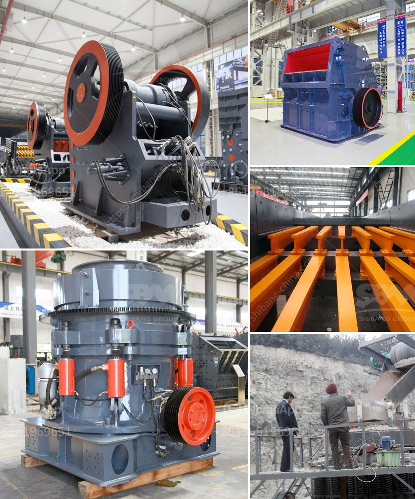

<h3>concrete crusher price in zimbabwe</h3>
With the rapid development of economy in Zimbabwe, the construction industry has experienced fast growth. The concrete industry is the largest consumer of materials worldwide, and its demand has been further boosted by the rapid urbanization and industrialization in the country. However, for the construction industry to thrive, it needs a reliable and efficient concrete crushing equipment. This is where the concrete crusher comes into play.

A concrete crusher is a machine used for crushing rubble, usually concrete, bricks, blocks, and pipes. It can also be used for crushing asphalt, ceramic waste, and aggregate materials. It is a cost-effective way to reduce waste and increase the profitability of your business. The price of a concrete crusher can vary significantly depending on the production capacity, the type of machine, and the level of automation. In Zimbabwe, you can find various types of concrete crushers for sale, especially the popular ones like jaw crushers and impact crushers.

Jaw crushers are a primary crusher used in mining and ore processing. Similar in function to a nutcracker, it crushes materials between two solid surfaces, one stationary and one moving. The aggregate is fed into the cavity and slowly crushed until it passes through the outlet at the bottom. Jaw crushers are known for their reliability, efficiency, and low operating costs.

On the other hand, impact crushers are commonly used in the secondary or tertiary crushing stage. They rely on impact to break down materials and are capable of producing finer particles. Impact crushers have a higher production capacity compared to jaw crushers and are often used in larger construction projects.

In Zimbabwe, the price of a concrete crusher varies depending on the size, capacity, and brand. Generally, small concrete crushers range from around $10,000 to $50,000, while larger ones can reach up to $200,000 or more. The availability of spare parts, the level of automation, and the quality of materials used in manufacturing can also affect the price.

It's important to consider not only the initial cost but also the long-term cost of owning a concrete crusher. Factors such as fuel consumption, maintenance, and wear parts replacement should be taken into account. It is advisable to choose a reputable supplier that offers reliable after-sales support, including spare parts availability and technical assistance. Additionally, it's crucial to compare prices and features from different suppliers to make an informed decision.

Investing in a concrete crusher can bring numerous benefits to your business. By recycling construction waste, you can save on disposal costs and contribute to environmental sustainability. It also allows you to produce high-quality aggregates for use in construction projects, reducing the need for expensive imported materials.

In conclusion, the price of a concrete crusher in Zimbabwe depends on various factors, including the size, capacity, and brand. To make the right purchasing decision, it's important to consider the long-term cost, availability of spare parts, and after-sales support. Investing in a concrete crusher can be a valuable addition to your construction business, helping you reduce waste, save money, and contribute to a more sustainable future.
<h3>Contact us</h3><ul><li><strong>Whatsapp:&nbsp;<a href="https://wa.me/8613661969651">+8613661969651</a></strong></li><li><a href="https://swt.shibang-china.com/?git&amp;zhl&amp;concrete crusher price in zimbabwe"><strong>Online Service(chat now)</strong></a></li></ul><h3>Related</h3><ul><li><a href='price limestone rock crusher.md'>price limestone rock crusher</a></li><li><a href='small used stone crusher machine in india.md'>small used stone crusher machine in india</a></li><li><a href='jual mesin limestone crusher.md'>jual mesin limestone crusher</a></li><li><a href='on sale used quarry machinery uk.md'>on sale used quarry machinery uk</a></li><li><a href='gypsum plants in india.md'>gypsum plants in india</a></li></ul>