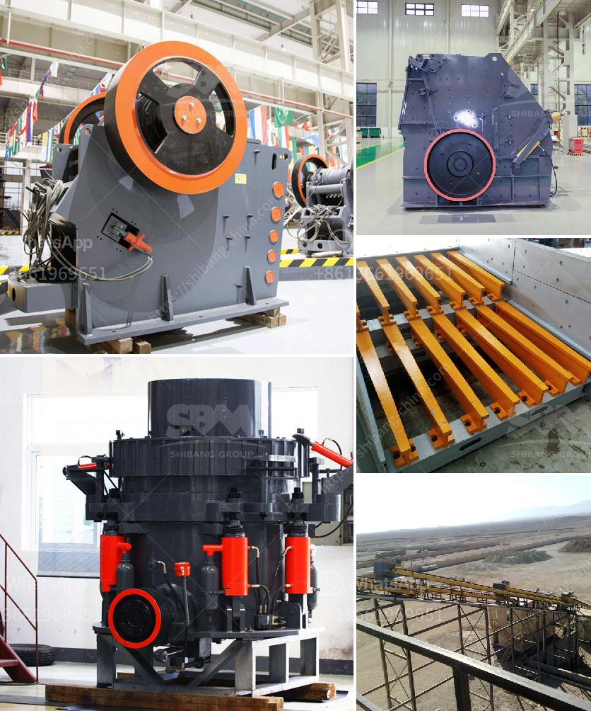

<h3>concrete crushers for rent nigeria</h3>
Concrete crushers for rent Nigeria is a common trend in the construction industry, especially for road construction, which is eco-friendly and sustainable as it reduces the pollution caused by concrete waste. It also saves a significant amount of money by eliminating the need to purchase new concrete for construction projects. More and more construction companies and contractors are opting for concrete crushers for rent in Nigeria rather than investing in expensive equipment.

To meet the burgeoning demand for concrete crushers for rent in Nigeria, the construction industry has been tapping into the services of local rental companies. Rental companies in Nigeria are providing a range of crushing and screening equipment for efficient and eco-friendly construction operations. These machines are designed to crush concrete and other construction materials into manageable sizes for recycling or disposal at the construction site or a designated recycling facility.

One of the key benefits of renting concrete crushers in Nigeria is the ability to eliminate the costs associated with transportation of the waste material away from the construction site. Rental units can be stationed directly on the site and the crushed material can be reused as fill, eliminating the need for additional transportation expenses.

Another advantage of renting concrete crushers in Nigeria is the ability to adjust and customize the desired aggregate sizes to suit specific construction requirements. By adjusting the crusher settings, various sizes of aggregates can be produced, ranging from 3/4 inches to 2 inches.

Additionally, renting concrete crushers in Nigeria provides contractors with access to advanced machinery and technology that may not be available within their fleet. Rental companies continuously update their equipment to provide the most efficient and technologically advanced solutions. This allows contractors to complete projects faster and achieve higher quality results, leading to increased client satisfaction.

Renting concrete crushers in Nigeria also allows contractors to be more flexible in their project planning and scheduling. They can easily rent the necessary equipment for the required duration without being bound by long-term equipment ownership. Additionally, rental companies often offer flexible rental periods, with options for daily, weekly, or monthly rentals to suit the specific needs of each project.

To ensure a smooth rental experience, contractors considering renting concrete crushers in Nigeria should ensure that the rental company has a comprehensive maintenance program in place. Regular maintenance of the equipment is essential for maximizing performance and minimizing downtime during the rental period.

In conclusion, renting concrete crushers in Nigeria is beneficial for both the environment and the construction industry. It provides an eco-friendly solution by reducing the amount of concrete waste that ends up in landfills. It also allows contractors to access advanced machinery and customize aggregate sizes, resulting in more efficient and higher quality construction projects. With the flexibility of rental periods and the elimination of transportation costs, renting concrete crushers in Nigeria is a cost-effective solution that is gaining popularity in the construction industry.
<h3>Contact us</h3><ul><li><strong>Whatsapp:&nbsp;<a href="https://wa.me/8613661969651">+8613661969651</a></strong></li><li><a href="https://swt.shibang-china.com/?git&amp;zhl&amp;concrete crushers for rent nigeria"><strong>Online Service(chat now)</strong></a></li></ul><h3>Related</h3><ul><li><a href='marbel grinding process.md'>marbel grinding process</a></li><li><a href='crushing and screening costs.md'>crushing and screening costs</a></li><li><a href='price limestone rock crusher.md'>price limestone rock crusher</a></li><li><a href='mobile crusher 70 ton.md'>mobile crusher 70 ton</a></li><li><a href='hammer mill in china.md'>hammer mill in china</a></li></ul>