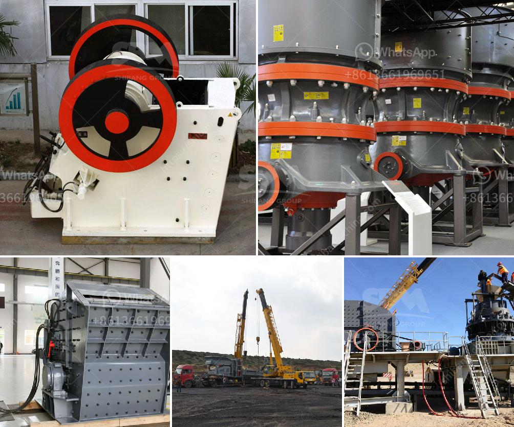

<h3>concrete crushing machines in kenya</h3>
Concrete is a versatile and durable material that is widely used in construction projects worldwide. It is the main component of buildings, bridges, roads, and other structures. However, over time, these structures may need to be demolished or renovated, and concrete crushing machines are used for this purpose.

Concrete crushing machines are specifically designed to break down concrete into smaller pieces in a controlled and efficient manner. It is essential for builders and contractors to have access to high-quality concrete crushing machines in order to get the job done efficiently and safely.

In Kenya, there is a growing demand for concrete crushing machines. These machines are widely used in construction projects, such as buildings, roads, bridges, and airports. Concrete crushing machines are also used for recycling purposes, which helps to reduce construction waste and conserve resources.

There are several types of concrete crushing machines available in the market. The most common ones are jaw crushers, impact crushers, and cone crushers. Each of these machines operates differently and has its own unique features.

Jaw crushers are the most commonly used concrete crushing machines. They work by applying pressure to the concrete, which forces it to break down into smaller pieces. Jaw crushers have a simple design and are capable of crushing large quantities of concrete quickly and efficiently.

Impact crushers, on the other hand, use impact force to break down concrete. They work by throwing the concrete against a hard surface, which causes it to break into smaller pieces. Impact crushers are faster than jaw crushers and are often used for larger projects.

Cone crushers, on the other hand, are used to crush concrete by squeezing it between two surfaces. This method is slower but produces a more uniform and finer product. Cone crushers are often used for projects that require high-quality concrete.

In Kenya, there are several companies that manufacture and supply concrete crushing machines. These machines are typically large and heavy-duty, designed to withstand the tough conditions of construction projects. They are typically powered by diesel engines or electric motors and can be stationary or mobile.

When choosing a concrete crushing machine in Kenya, it is important to consider factors such as the type and size of the project, the required output of the crushed concrete, and the budget. It is recommended to consult with experts in the construction industry to determine the most suitable machine for the job.

In conclusion, concrete crushing machines are essential for breaking down concrete into smaller pieces in construction projects. In Kenya, there is a growing demand for these machines due to the increasing number of construction projects and the need for recycling materials. It is important for builders and contractors to have access to high-quality concrete crushing machines to ensure efficient and safe demolition and recycling processes.
<h3>Contact us</h3><ul><li><strong>Whatsapp:&nbsp;<a href="https://wa.me/8613661969651">+8613661969651</a></strong></li><li><a href="https://swt.shibang-china.com/?git&amp;zhl&amp;concrete crushing machines in kenya"><strong>Online Service(chat now)</strong></a></li></ul><h3>Related</h3><ul><li><a href='mica powder mill equipment supplier.md'>mica powder mill equipment supplier</a></li><li><a href='how much crusher machine.md'>how much crusher machine</a></li><li><a href='barite bulking process.md'>barite bulking process</a></li><li><a href='crusher plant dengan kapasitas 100 ton h.md'>crusher plant dengan kapasitas 100 ton h</a></li><li><a href='jaw crusher technical parameter.md'>jaw crusher technical parameter</a></li></ul>