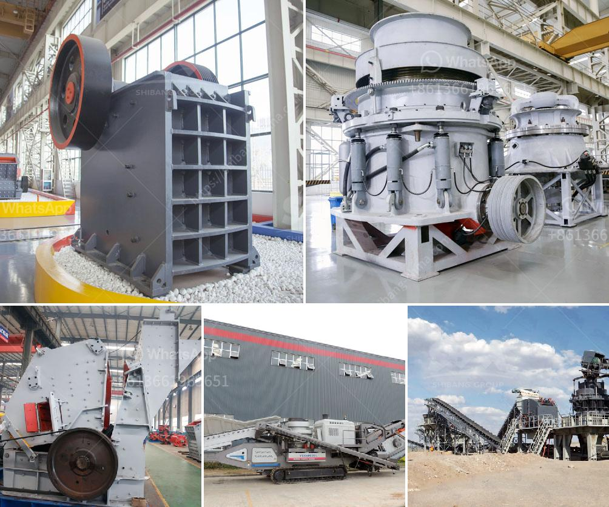

<h3>concrete cube crushing machine price</h3>
Concrete cube crushing machine is an essential equipment in the construction industry. It is used for testing the compression strength of concrete cubes. Individually, most construction companies have their own cube testing machine to ensure that the concrete they use for construction is reliable and meets the required strength. But, for those who do not have their own machine or are planning to upgrade their existing one, it is essential to know the price factors before making a purchase.

The price of a concrete cube crushing machine varies depending on the country and other factors such as the production capacity, brand, and model. Some machines are more expensive due to their advanced features, higher production capacity, and longer durability. Therefore, it is important to consider these factors while choosing a machine.

Starting with the production capacity, this factor plays a crucial role in determining the machine's price. Machines with higher production capacity have a higher price tag. The production capacity of these machines can range from 50 to 600 cubes per hour. Construction companies with large-scale projects prefer machines with higher production capacity to save time and meet their project deadlines.

The brand and model of the machine also impact the price. Reputed brands with a long-standing history typically offer high-quality machines that may cost more. These brands have established their reputation and are known for producing reliable and durable machines. It is advisable to invest in a well-known brand that has good after-sales service to ensure proper maintenance and support.

Furthermore, advanced features and technologies incorporated in the machine can also influence its price. Some machines come with automated features, touch screen displays, and data logging capabilities. They provide more accurate and efficient testing results, which can save time and manpower. However, these advanced features often come with a higher price tag.

Besides considering the machine's price, it is also important to factor in the availability of spare parts, after-sales service, and warranty offered by the manufacturer. These factors contribute to the overall cost of ownership and should be taken into account when making a purchase decision.

In conclusion, the price of a concrete cube crushing machine varies based on several factors such as production capacity, brand, model, and advanced features. Construction companies should carefully analyze their requirements, budget, and the specific needs of their projects before investing in a machine. It is advisable to research different brands, compare prices, and consider after-sales service to make an informed decision that meets their needs in the long run. Additionally, considering the long-term cost of ownership by factoring in after-sales service, spare parts availability, and warranty is essential to ensure a smooth operation and durability of the machine.
<h3>Contact us</h3><ul><li><strong>Whatsapp:&nbsp;<a href="https://wa.me/8613661969651">+8613661969651</a></strong></li><li><a href="https://swt.shibang-china.com/?git&amp;zhl&amp;concrete cube crushing machine price"><strong>Online Service(chat now)</strong></a></li></ul><h3>Related</h3><ul><li><a href='fairly used quarry crusher in nigeria price.md'>fairly used quarry crusher in nigeria price</a></li><li><a href='diamond wash plants for sale in south africa.md'>diamond wash plants for sale in south africa</a></li><li><a href='gypsum powder making plant.md'>gypsum powder making plant</a></li><li><a href='mini rock crusher manufacturer in china.md'>mini rock crusher manufacturer in china</a></li><li><a href='250tph grinding equipment price.md'>250tph grinding equipment price</a></li></ul>