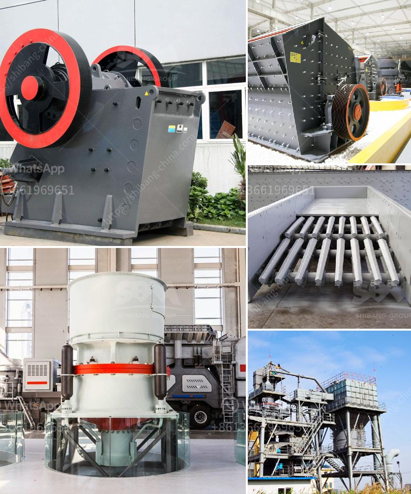

<h3>concrete will crusher for sale in uae</h3>
Concrete is one of the most used construction materials in the world. It is strong, durable, and versatile, making it ideal for various construction projects. However, at the end of its lifespan, concrete can become a burden to dispose of, as it takes up significant space in landfills. To combat this issue, concrete crushers have been developed to efficiently reduce concrete waste and recycle it into reusable materials.

In the United Arab Emirates (UAE), concrete crushers are widely used in the construction industry. In recent years, the UAE government has been encouraging sustainable practices in the construction industry through the introduction of policies and regulations. With the aim to reduce construction and demolition (C&D) waste, concrete crusher machines have been employed by contractors to convert their waste materials into reusable aggregates.

Concrete crushers play a vital role in enhancing the efficiency of the construction process. By reducing the size of concrete debris and recycling them effectively, crushers enable contractors to save time and money by eliminating the need for disposal. Furthermore, reusing the crushed concrete as aggregates for new construction projects helps preserve natural resources and reduce carbon emissions associated with the production of new building materials.

When looking for a concrete crusher for sale in the UAE, one can expect to find machines that vary in size and capabilities. These machines come in hydraulic or non-hydraulic options, depending on the crushing capabilities of the equipment. Hydraulic concrete crushers use a movable jaw that is fixed with two powerful cylinders to perform the crushing action. The hydraulic system allows the operator to easily adjust the opening size of the crusher, eliminating the need for costly shims.

Non-hydraulic concrete crushers are also available and are typically used for smaller projects or where hydraulic capabilities are not required. These crushers rely on a manual lever mechanism to crush concrete debris into smaller pieces. While they are not as powerful as their hydraulic counterparts, these crushers can still effectively reduce waste concrete and facilitate recycling.

When purchasing a concrete crusher, there are several factors to consider. Firstly, it is important to assess the crushing capacity required for the project at hand. This will determine the size and type of crusher needed. Additionally, the durability and reliability of the machine should be taken into consideration, as this will impact its lifespan and the frequency of maintenance required.

In the UAE, there are various suppliers and manufacturers of concrete crushers for sale. Some of the leading companies in the region that supply specialized equipment for the construction and recycling industries include Terex, Sandvik, and Metso. These manufacturers offer a wide range of crusher machines with different specifications and features to suit various project requirements.

In conclusion, the use of concrete crushers in the UAE is a sustainable solution to the challenges posed by concrete waste accumulation. Concrete crushers reduce waste and facilitate recycling, leading to a greener construction industry. Additionally, the availability of different crusher types in the market allows contractors to choose the most suitable equipment for their projects. With the UAE government's emphasis on sustainable practices, the demand for concrete crushers is expected to increase, providing new opportunities for suppliers and manufacturers in the industry.
<h3>Contact us</h3><ul><li><strong>Whatsapp:&nbsp;<a href="https://wa.me/8613661969651">+8613661969651</a></strong></li><li><a href="https://swt.shibang-china.com/?git&amp;zhl&amp;concrete will crusher for sale in uae"><strong>Online Service(chat now)</strong></a></li></ul><h3>Related</h3><ul><li><a href='ball mill manufacturers in korea.md'>ball mill manufacturers in korea</a></li><li><a href='supplier for crusher.md'>supplier for crusher</a></li><li><a href='mini mobile crusher.md'>mini mobile crusher</a></li><li><a href='limestone processing equipment in south africa.md'>limestone processing equipment in south africa</a></li><li><a href='ball mill koppers.md'>ball mill koppers</a></li></ul>