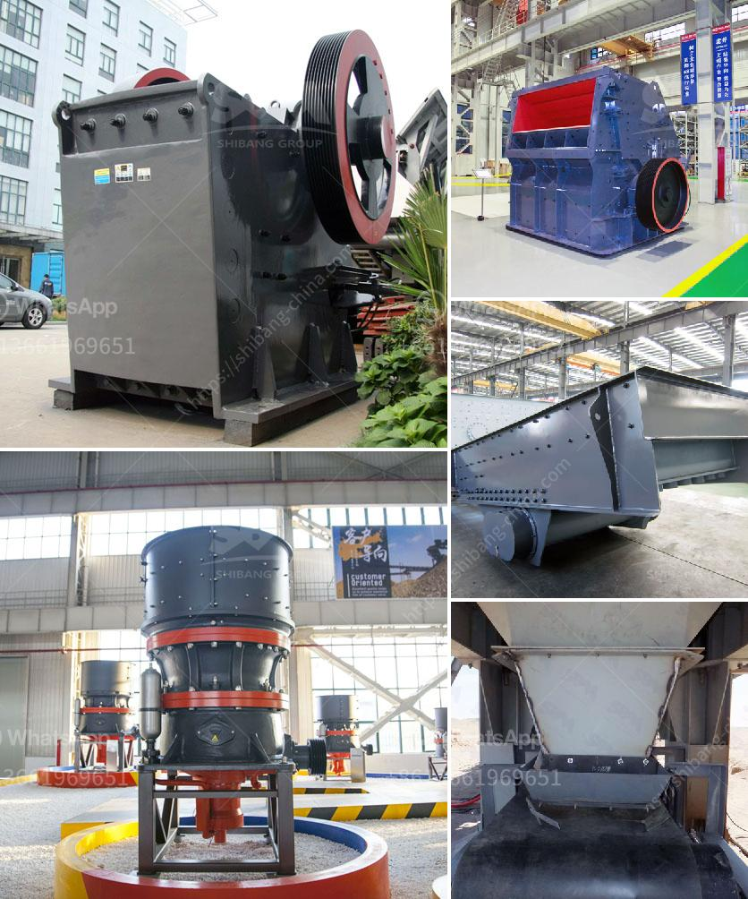

<h3>cone crusher dimension specification</h3>
Cone crushers are widely used in the mining and aggregates industry to crush various rock materials. The size of the cone crushers dimension specifications depends on the application requirements. Cone crushers are typically used for secondary or tertiary crushing in hard rock and gravel applications.

One important aspect of cone crusher dimension specification is the crushing chamber design, which determines the maximum feed size and the capacity of the machine. The crushing chamber is the space between the mantle and the concave. The mantle is the moving part, and the concave is the stationary part of the crushing chamber.

The dimension specifications of cone crushers vary depending on the application. Some cone crushers have a narrow crushing chamber, while others have a wide opening. The dimension specifications also include the maximum feed size and the minimum discharge opening size.

The maximum feed size of a cone crusher is the largest rock particle that can enter the crushing chamber. This parameter is important because it determines the capacity and the reduction ratio of the crusher. A smaller maximum feed size allows for higher crushing efficiency, while a larger maximum feed size can lead to higher production rates.

The minimum discharge opening size of a cone crusher is the smallest gap between the mantle and the concave at the bottom of the crushing chamber. This parameter determines the final product size. A smaller discharge opening size produces a finer product, while a larger discharge opening size produces a coarser product.

Another important dimension specification of cone crushers is the power rating. The power rating indicates the maximum power that the crusher can handle. This parameter is crucial because it determines the operational efficiency and productivity of the machine. A higher power rating allows for higher throughput and better crushing performance.

In addition to the dimension specifications, cone crushers may also have additional features and options. For example, some cone crushers have a hydraulic setting adjustment system, which allows for easy and quick changes to the crusher settings. This feature is beneficial because it allows the operator to optimize the crusher performance for different applications and materials.

Overall, cone crusher dimension specifications play a crucial role in determining the performance and capabilities of the machine. It is important to consider the application requirements, such as the feed size, discharge opening size, and power rating, when selecting a cone crusher for a specific operation. By choosing the right dimensions and features, operators can achieve optimal crushing efficiency and productivity for their operations.
<h3>Contact us</h3><ul><li><strong>Whatsapp:&nbsp;<a href="https://wa.me/8613661969651">+8613661969651</a></strong></li><li><a href="https://swt.shibang-china.com/?git&amp;zhl&amp;cone crusher dimension specification"><strong>Online Service(chat now)</strong></a></li></ul><h3>Related</h3><ul><li><a href='copper crusher exporter in south africa.md'>copper crusher exporter in south africa</a></li><li><a href='crusher plants south africa.md'>crusher plants south africa</a></li><li><a href='lime grinding machine manufacturer in kolhapur.md'>lime grinding machine manufacturer in kolhapur</a></li><li><a href='cement machinery suppliers grinding unit.md'>cement machinery suppliers grinding unit</a></li><li><a href='chrome ore beneficiation plant in china.md'>chrome ore beneficiation plant in china</a></li></ul>