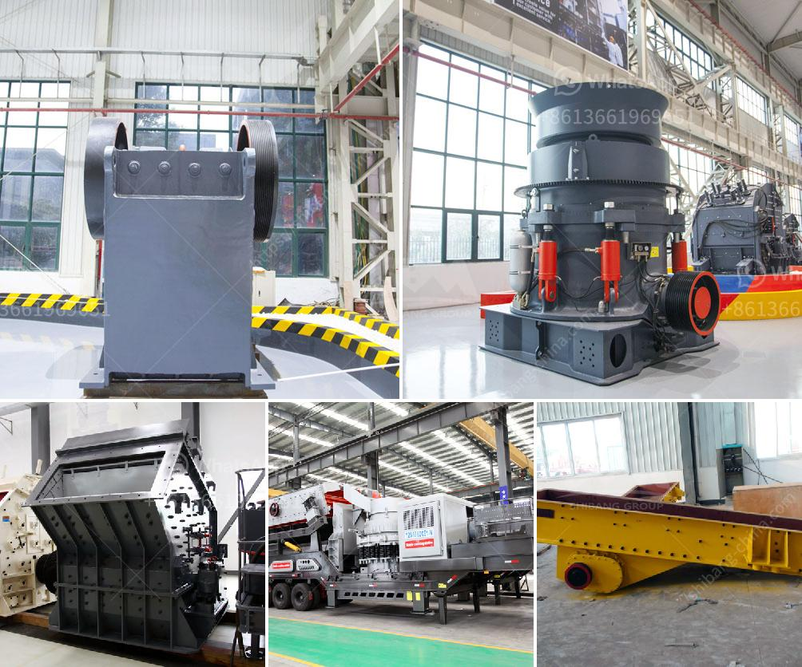

<h3>cone crusher size</h3>
Cone crushers are widely used in the mining and aggregates industry to crush materials with a high hardness and abrasiveness. These machines have a cone-shaped crushing chamber that is lined with a concave and mantle. These features allow the cone crusher to handle materials of different sizes and hardness levels efficiently.

One of the critical factors in determining the cone crusher's performance is the size of the crushing chamber. The size of the chamber affects the product size and the capacity of the machine. Generally, a larger crushing chamber provides a higher volume of material to be processed, resulting in higher production rates.

The size of the cone crusher's crushing chamber is usually specified as the closed side setting (CSS). This measurement represents the distance between the mantle and concave at the bottom of the crusher. The CSS determines the size of the crushed product and also affects the capacity of the machine.

When selecting a cone crusher, it is crucial to consider the desired product size and the required production rate. Smaller CSS settings produce a finer product, while larger CSS settings result in a coarser product. Therefore, choosing the correct CSS setting is essential to achieve the desired gradation and product shape.

However, it is important to note that reducing the CSS setting may limit the crusher's capacity. A smaller CSS can cause the crusher to choke, leading to a decrease in production rates. This occurs when the crushing chamber becomes clogged with uncrushed material, preventing further material from entering the chamber.

On the other hand, increasing the CSS setting can improve the capacity of the machine but may result in a coarser product. The trade-off between product size and production rate must be carefully considered when adjusting the CSS setting.

In addition to the CSS setting, the cone crusher's size is also influenced by the feed material's size distribution. Ideally, the feed material should be evenly distributed across the crushing chamber to ensure efficient crushing and minimize the risk of cavity blockage.

Properly sizing the cone crusher also involves understanding the feed material's hardness. Harder materials require more crushing power and may necessitate a larger crusher size or a different configuration of the crushing chamber.

In conclusion, the size of the cone crusher plays a significant role in determining its performance. The correct CSS setting and understanding the feed material's size distribution and hardness are essential factors in optimizing the crusher's efficiency and productivity. Careful consideration of these factors will ensure that the cone crusher is correctly sized for the application, resulting in maximum throughput and desired product quality.
<h3>Contact us</h3><ul><li><strong>Whatsapp:&nbsp;<a href="https://wa.me/8613661969651">+8613661969651</a></strong></li><li><a href="https://swt.shibang-china.com/?git&amp;zhl&amp;cone crusher size"><strong>Online Service(chat now)</strong></a></li></ul><h3>Related</h3><ul><li><a href='barite grinding plant machine sale.md'>barite grinding plant machine sale</a></li><li><a href='crushing and mining equipment companies in uae.md'>crushing and mining equipment companies in uae</a></li><li><a href='copper crusher plant for sale chile.md'>copper crusher plant for sale chile</a></li><li><a href='quarry dust in concrete sand making stone quarry.md'>quarry dust in concrete sand making stone quarry</a></li><li><a href='company that work in crushing stones.md'>company that work in crushing stones</a></li></ul>