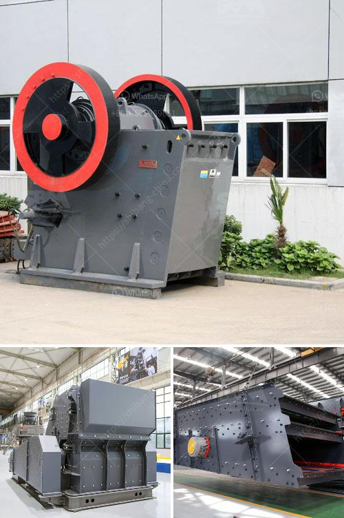

<h3>cone crusher spare parts</h3>
Cone crusher spare parts play an integral role in the crushing process. They are essential for the efficient operation of a cone crusher and help ensure that the crusher runs smoothly.

In the manufacturing industry, cone crushers are one of the most widely used crushing machines. They are used in various stages of crushing to reduce the size of materials and facilitate the extraction of valuable minerals. These machines are commonly found in quarries, construction sites, and mining operations.

As with any machine, cone crushers are subject to wear and tear over time. The constant impact and friction from rocks and minerals can cause damage to the internal components of a cone crusher. This is where cone crusher spare parts come into play.

Cone crusher spare parts are designed to extend the functional life of your machine and improve its overall performance. The spare parts, including the concave and mantle, are made of high-manganese steel which ensures the durability of the parts. These materials are known for their ability to withstand extreme conditions, such as heavy impact and high temperatures.

The concave and mantle are the key components of a cone crusher. They are responsible for crushing the stones and maintaining the shape of the cone crusher cavity. Without proper functioning parts, the cone crusher would not be able to perform at its best.

One of the main benefits of cone crusher spare parts is that they provide a quick and easy way to replace worn-out parts. Instead of replacing the entire machine, you can simply replace the damaged parts, saving time and money. This also reduces downtime, as the replacement process is fast and efficient.

Another advantage of cone crusher spare parts is their versatility. They are available in different shapes and sizes to fit various cone crusher models. This ensures that you can find the right spare parts for your specific machine, regardless of its brand or model.

Using genuine cone crusher spare parts is crucial for the optimal performance of your machine. Counterfeit or low-quality parts may cause further damage to the cone crusher and affect its efficiency. It is therefore important to purchase spare parts from a reputable supplier that offers genuine and high-quality products.

Regular maintenance and inspection of cone crusher spare parts are also essential. By conducting routine checks, you can identify any potential issues and address them before they escalate into more significant problems. This can help extend the lifespan of your cone crusher and reduce the frequency of breakdowns.

In conclusion, cone crusher spare parts are a must-have for every quarry plant. They ensure the efficient and reliable operation of cone crushers, allowing you to maximize productivity and minimize maintenance costs. By investing in genuine and high-quality spare parts, you can enhance the performance of your cone crusher and achieve optimal results.
<h3>Contact us</h3><ul><li><strong>Whatsapp:&nbsp;<a href="https://wa.me/8613661969651">+8613661969651</a></strong></li><li><a href="https://swt.shibang-china.com/?git&amp;zhl&amp;cone crusher spare parts"><strong>Online Service(chat now)</strong></a></li></ul><h3>Related</h3><ul><li><a href='cement project cost in pakistan.md'>cement project cost in pakistan</a></li><li><a href='mini mobile crusher.md'>mini mobile crusher</a></li><li><a href='stone powder milling small machine.md'>stone powder milling small machine</a></li><li><a href='roller mill for gravel.md'>roller mill for gravel</a></li><li><a href='crusher machine manufacturers in india.md'>crusher machine manufacturers in india</a></li></ul>