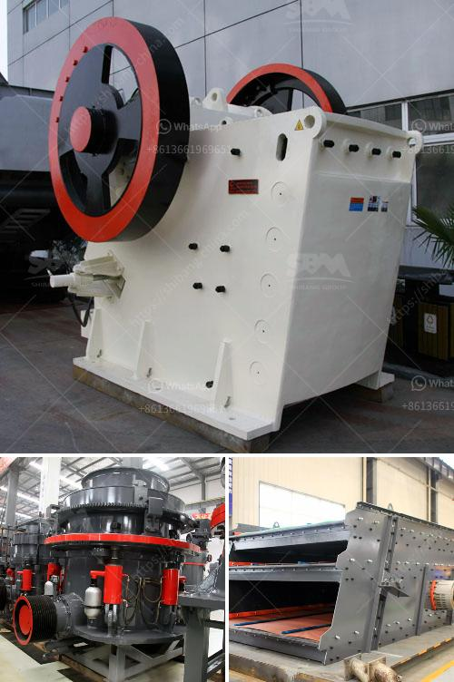

<h3>construction equipment made in taiwan</h3>
Taiwan has long established itself as a hub for technological advancements and innovation. While most renowned for its electronic and technology industries, the nation has also made significant strides in the field of construction equipment. Taiwanese manufacturers have emerged as global leaders in producing high-quality machinery, catering to the growing demand for efficient and reliable equipment around the world.

One of the key factors behind Taiwan's success in the construction equipment industry is its commitment to innovation. Taiwanese manufacturers consistently invest in research and development to improve their products and stay at the forefront of the market. This dedication to innovation has led to the creation of cutting-edge machinery that meets the ever-evolving needs of the construction industry.

Taiwanese construction equipment manufacturers offer a wide range of products that cater to various construction needs. From excavators, loaders, and bulldozers to cranes, concrete pumps, and drilling equipment, the industry in Taiwan has a comprehensive portfolio that can tackle diverse projects with ease.

What sets Taiwanese construction equipment apart from others is its exceptional quality. Taiwanese manufacturers adhere to rigorous quality control measures throughout the production process, ensuring that every piece of machinery meets international standards. This commitment to quality has earned them a reputation for producing reliable and durable equipment that can withstand the toughest operating conditions. The emphasis on quality control has also allowed Taiwanese manufacturers to build long-term, trust-based relationships with clients worldwide.

In addition to quality, Taiwanese construction equipment manufacturers prioritize safety in their designs. These companies understand the risks involved in construction projects and strive to develop machinery that keeps operators and workers safe on-site. From advanced safety features like emergency stop buttons and automatic overload protection to ergonomic designs that reduce operator fatigue, Taiwanese equipment is engineered to prioritize the well-being of its users.

Furthermore, Taiwanese manufacturers have embraced sustainable practices in response to the global environmental crisis. They have invested in developing energy-efficient equipment and reducing emissions through innovative engine technologies. By incorporating eco-friendly measures into their machines, Taiwanese manufacturers are not only reducing their environmental impact but also helping construction companies meet sustainability goals.

The success of construction equipment made in Taiwan is demonstrated by its growing presence in global markets. Taiwanese manufacturers have expanded their reach to countries around the world, supplying cost-effective and reliable machinery that aids in infrastructure development. Today, it is not uncommon to see Taiwanese construction equipment being used in major projects across Asia, the Americas, and Europe.

In conclusion, Taiwan's construction equipment industry stands as a testament to the nation's commitment to quality and innovation. With a focus on research and development, these manufacturers have created a wide range of machinery that meets international standards. By prioritizing safety and sustainability, Taiwanese construction equipment manufacturers have gained the trust of clients globally. As infrastructure needs continue to grow, the industry is poised to play a crucial role in shaping the future of construction worldwide.
<h3>Contact us</h3><ul><li><strong>Whatsapp:&nbsp;<a href="https://wa.me/8613661969651">+8613661969651</a></strong></li><li><a href="https://swt.shibang-china.com/?git&amp;zhl&amp;construction equipment made in taiwan"><strong>Online Service(chat now)</strong></a></li></ul><h3>Related</h3><ul><li><a href='industrial mill price industrial mill.md'>industrial mill price industrial mill</a></li><li><a href='ball mills mfg in kenya.md'>ball mills mfg in kenya</a></li><li><a href='vibrating screen price philippines.md'>vibrating screen price philippines</a></li><li><a href='jaw crusher start up procedure.md'>jaw crusher start up procedure</a></li><li><a href='stone sand making machine in nignia.md'>stone sand making machine in nignia</a></li></ul>