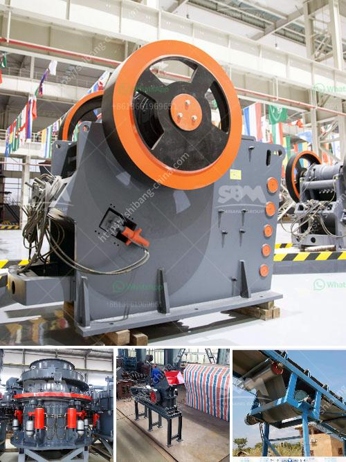

<h3>construction equipment manufacturer in turkey</h3>
Turkey is renowned for being a global manufacturing hub, and its construction equipment sector plays a significant role in its industrial success. With a rich history and a favorable geographical position, Turkey has emerged as a prominent construction equipment manufacturer in recent years. Several factors contribute to Turkey's success in this industry, including innovative technology, strong engineering capabilities, and a skilled workforce.

One of the key reasons behind Turkey's rise as a construction equipment manufacturer is its continuous investment in research and development. Turkish companies have embraced technological advancements and implemented them into their manufacturing processes, resulting in high-quality and efficient equipment. These innovations have allowed Turkish construction equipment manufacturers to compete globally and meet international standards.

Additionally, Turkey benefits from its strategic location, serving as a gateway between Europe, Asia, and the Middle East. This position enables Turkish manufacturers to have easy access to international markets, giving them a competitive advantage. The country's strong transportation infrastructure, including well-connected seaports, airports, and highways, facilitates the efficient distribution of construction equipment, further boosting its manufacturing sector.

Turkey is also home to numerous engineering and technical universities, providing a well-educated and skilled workforce for the construction equipment industry. Turkish engineers and technicians are known for their expertise in various areas, such as product design, manufacturing processes, and quality control. This highly qualified workforce ensures that the construction equipment produced in Turkey is reliable, durable, and meets customer expectations.

Moreover, Turkish construction equipment manufacturers place great importance on producing environmentally friendly and sustainable products. The industry is adapting to global trends and regulations by investing in cleaner technologies and implementing energy-efficient practices. As sustainability becomes a global priority, Turkish manufacturers are positioning themselves as reliable partners for environmentally conscious clients.

Turkish construction equipment manufacturers offer a wide range of products to cater to the diverse needs of the construction industry. These include excavators, loaders, bulldozers, cranes, and concrete machinery, among others. Companies in Turkey focus on producing equipment suitable for various construction projects, from residential buildings to large-scale infrastructure development.

In recent years, Turkish construction equipment manufacturers have significantly increased their exports, expanding their presence in international markets. Their ability to understand customer requirements and adapt their products accordingly has been crucial in gaining competitive advantage globally. Furthermore, the favorable price-quality ratio of Turkish construction equipment has attracted buyers worldwide, further boosting Turkey's reputation as a reliable manufacturer.

To conclude, Turkey's construction equipment manufacturing industry is thriving due to its investment in research and development, strategic location, skilled workforce, commitment to sustainability, and a wide product range. The country's manufacturers offer innovative and high-quality products that meet international standards and cater to various construction needs. The rise of the Turkish construction equipment industry is a testament to the country's industrial prowess and its ability to compete globally.
<h3>Contact us</h3><ul><li><strong>Whatsapp:&nbsp;<a href="https://wa.me/8613661969651">+8613661969651</a></strong></li><li><a href="https://swt.shibang-china.com/?git&amp;zhl&amp;construction equipment manufacturer in turkey"><strong>Online Service(chat now)</strong></a></li></ul><h3>Related</h3><ul><li><a href='vertical coal mill manufacturer in china.md'>vertical coal mill manufacturer in china</a></li><li><a href='used crushing machine price.md'>used crushing machine price</a></li><li><a href='basalt rock quarry plant.md'>basalt rock quarry plant</a></li><li><a href='mobile crusher plant supplier in the philippines.md'>mobile crusher plant supplier in the philippines</a></li><li><a href='how much is a hammer mill.md'>how much is a hammer mill</a></li></ul>