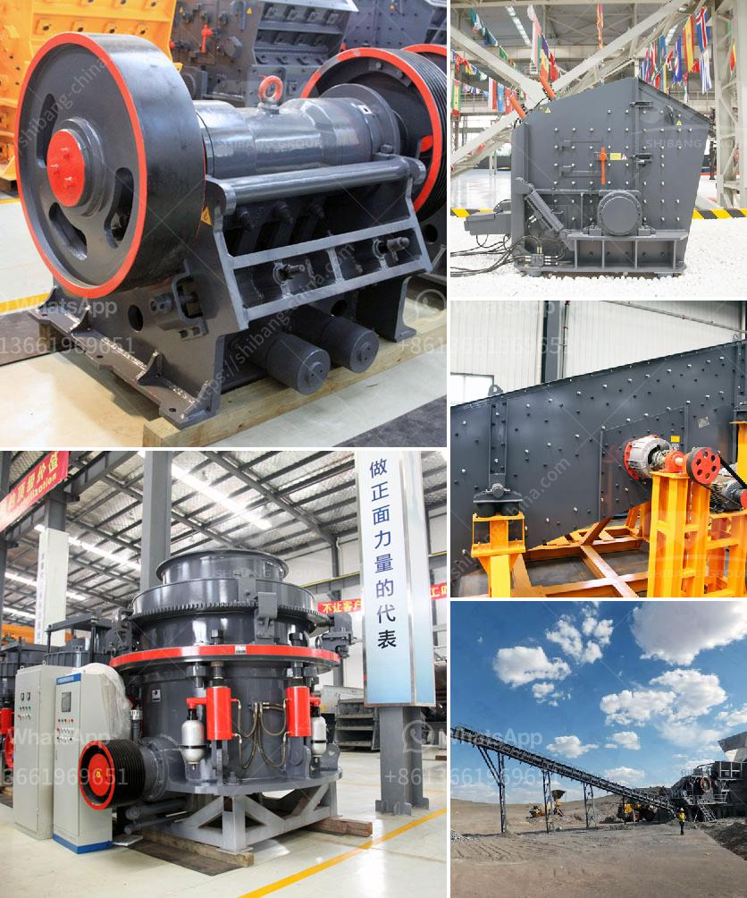

<h3>construction of roller mill</h3>
The roller mill is a type of grinding machine that is commonly used for milling materials such as grains or other agricultural products. It consists of a pair of parallel cylindrical rollers that rotate against each other, crushing the material into powder.

The construction of a roller mill starts with a solid foundation. Firstly, the base of the machine needs to be constructed. A thick metal plate is used to create a strong and stable foundation. This ensures that the machine remains sturdy during operation, preventing any vibrations or movements that could affect the quality of the milled product.

The next step in the construction process is to build the frame of the roller mill. This is usually made of steel or cast iron to provide strength and durability. The frame is designed to support the weight of the rollers and other components, as well as withstand the forces generated during the milling process.

Once the frame is completed, the rollers are installed. These are usually made of steel and are carefully machined to ensure smooth and even rotation. The rollers are mounted on bearings that allow them to rotate freely, reducing friction and ensuring efficient operation.

In addition to the rollers, the roller mill also includes other important components such as a motor and a control system. The motor provides the power necessary to drive the rollers, while the control system allows the operator to adjust the speed and pressure of the milling process.

To protect the rollers and other components from wear and tear, the roller mill is often equipped with a protective casing. This casing is made of a durable material such as steel or aluminum and helps to prevent dust and debris from entering the machine.

Overall, the construction of a roller mill involves careful planning and precision engineering. Each component is carefully designed and manufactured to ensure optimal performance and longevity. With its compact design and efficient operation, the roller mill is a valuable tool in various industries including agriculture, food processing, and mining.

In conclusion, the construction of a roller mill involves the assembly of several important components including the base, frame, rollers, motor, control system, and protective casing. Each component is carefully designed and manufactured to ensure efficient and reliable operation. The roller mill is a versatile machine that can be used for a wide range of applications, making it an important tool in various industries.
<h3>Contact us</h3><ul><li><strong>Whatsapp:&nbsp;<a href="https://wa.me/8613661969651">+8613661969651</a></strong></li><li><a href="https://swt.shibang-china.com/?git&amp;zhl&amp;construction of roller mill"><strong>Online Service(chat now)</strong></a></li></ul><h3>Related</h3><ul><li><a href='silica sand processing plant flowchart.md'>silica sand processing plant flowchart</a></li><li><a href='gold wash plant price in nigeria.md'>gold wash plant price in nigeria</a></li><li><a href='cost for set up of cement factory.md'>cost for set up of cement factory</a></li><li><a href='small crusher project.md'>small crusher project</a></li><li><a href='quarry crusher equipment manufacturer in turkey.md'>quarry crusher equipment manufacturer in turkey</a></li></ul>