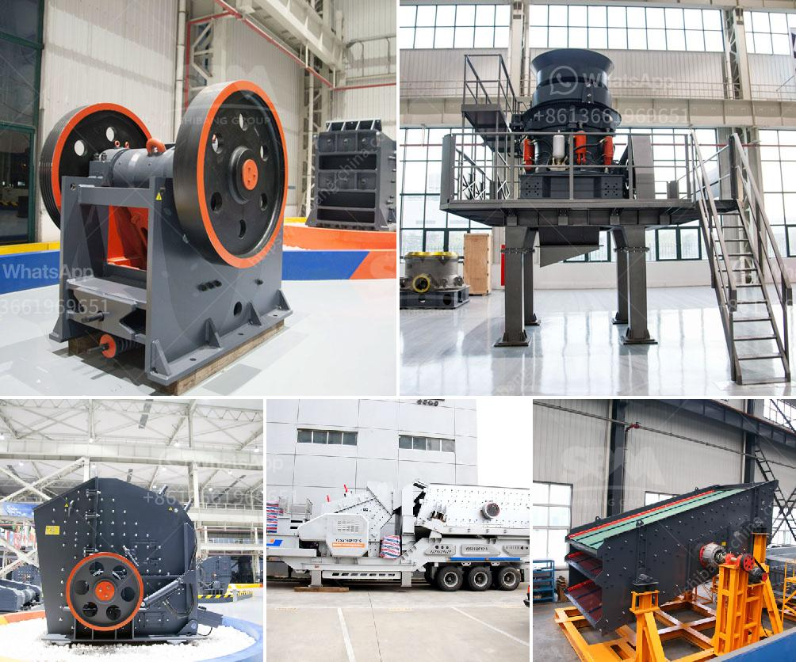

<h3>continuous or discontinuous ball mills</h3>
Ball mills are a common grinding equipment used in the mineral processing industry to grind various minerals and produce ore pulp. They can be divided into two types: continuous ball mills and discontinuous ball mills. The continuous ball mill is named after its continuous operation, while the discontinuous ball mill is commonly called a batch ball mill.

Continuous ball mills are widely used in various industries like mineral processing, building materials, chemical industry, and so on, because of their advantages in the grinding process. The grinding media in continuous ball mills is usually steel balls, which are lifted by the rotation of the cylinder and cascade down to crush and grind the ore. Continuous operation ensures high productivity and efficiency. Additionally, continuous ball mills have a larger capacity and can grind materials with a wide range of particle sizes, making them suitable for both coarse and fine grinding.

On the other hand, discontinuous ball mills have a different grinding mechanism. They operate in batches, with a certain amount of material loaded into the mill and then processed in a closed-loop system. The grinding media in a discontinuous ball mill can be made of ceramics, rubber, or steel balls, depending on the hardness and abrasiveness of the ores being ground. Discontinuous ball mills are relatively simple and easy to operate, and they have less energy consumption compared to continuous ball mills.

Despite their differences, both continuous and discontinuous ball mills have their advantages and disadvantages. Continuous ball mills offer higher productivity and can handle a larger capacity, but they consume more energy. In contrast, discontinuous ball mills have lower energy consumption but a smaller capacity. The choice between the two types of mills depends on the specific requirements of the process and the materials being ground.

Continuous ball mills are preferred when high productivity and efficiency are crucial, especially for large-scale mineral processing operations. They are also suitable for grinding materials that require a uniform particle size distribution. On the other hand, discontinuous ball mills are more suitable for small-scale operations or grinding processes that require a fine or ultra-fine particle size distribution.

In conclusion, continuous and discontinuous ball mills have their own advantages and disadvantages. The choice between the two types of mills depends on the specific requirements of the grinding process, including the desired particle size distribution, the energy consumption, and the capacity. It is important to carefully evaluate these factors before selecting the appropriate type of ball mill for a given application.
<h3>Contact us</h3><ul><li><strong>Whatsapp:&nbsp;<a href="https://wa.me/8613661969651">+8613661969651</a></strong></li><li><a href="https://swt.shibang-china.com/?git&amp;zhl&amp;continuous or discontinuous ball mills"><strong>Online Service(chat now)</strong></a></li></ul><h3>Related</h3><ul><li><a href='industrial mill price industrial mill.md'>industrial mill price industrial mill</a></li><li><a href='old impact crushing plant for sale.md'>old impact crushing plant for sale</a></li><li><a href='crushing b series vsi crusher.md'>crushing b series vsi crusher</a></li><li><a href='price list of grinding equipment for sale.md'>price list of grinding equipment for sale</a></li><li><a href='stone crushing machines for brick making.md'>stone crushing machines for brick making</a></li></ul>