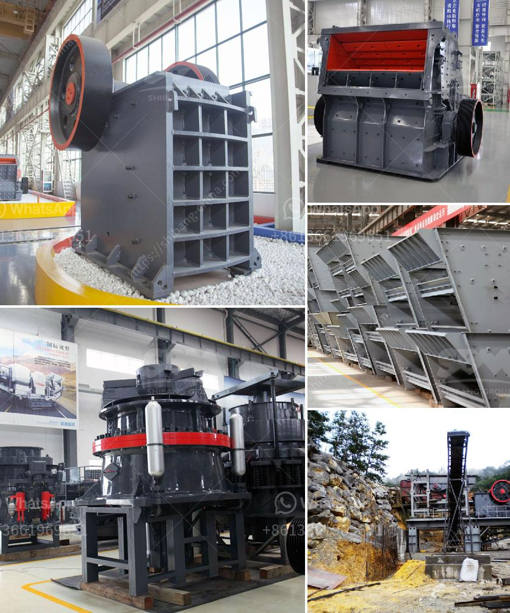

<h3>conveyor belt capacity ton per hours</h3>
Conveyor belts are an essential tool in the material handling sector. They are strips of continuous moving belts used to transport materials from one place to another, such as from the loading point to the unloading point. They can move large volumes of materials quickly and efficiently over long distances, enabling industries to increase their productivity.

One of the most important factors to consider when designing a conveyor belt system is the desired capacity of material transportation. This capacity is measured in terms of tons per hour for bulk materials, and can be defined as the total weight of the material transported within a specific time frame. The conveyor belt capacity is determined by researching the available options and analyzing the requirements of the application.

Firstly, it is vital to understand the characteristics of the specific material that will be transported. Each material has its own unique properties, such as density, particle size, and flowability. These properties directly affect the conveyor belt capacity, as they determine how much material can be carried at any given time. For example, light materials may require higher belt speeds to achieve the desired ton per hour capacity, while heavy materials may necessitate slower speeds to prevent belt damage or motor overload.

Secondly, the dimensions and layout of the conveyor system play a crucial role in determining the capacity. Conveyor belts can be customized to fit the available space and specific needs of the application. Longer belts can transport materials over greater distances, but this may result in higher power consumption. On the other hand, shorter belts may limit the capacity and require frequent loading/unloading processes. It is important to strike a balance between space availability, power consumption, and material transportation capacity to optimize the overall system efficiency.

Moreover, the design of the conveyor belt itself is significant in determining the overall capacity. Various factors should be considered, such as belt width, belt speed, and the number and spacing of carrying idlers. A wider belt allows for a greater material carrying area and, consequently, a higher capacity. However, wider belts may require stronger motors or supporting structures. Similarly, a higher belt speed can increase the capacity, but it may also lead to increased wear and tear of the belt surface and require more maintenance.

Lastly, the efficiency of the conveyor system relies on proper maintenance and regular inspections. A well-maintained conveyor belt will ensure optimal working conditions and prevent unexpected breakdowns and delays. Routine cleaning and lubrication of the belt, as well as regular inspection of the motor, pulleys, and bearings, are essential to keep the system running smoothly and maintain the desired ton per hour capacity.

In conclusion, conveyor belts are indispensable tools for material handling and provide a significant increase in productivity for various industries. The capacity of a conveyor belt system is measured in tons per hour and depends on the characteristics of the material to be transported, the dimensions and layout of the system, and the design of the conveyor belt itself. By carefully considering these factors and implementing proper maintenance practices, businesses can ensure the efficient and reliable transportation of materials with their conveyor belt systems.
<h3>Contact us</h3><ul><li><strong>Whatsapp:&nbsp;<a href="https://wa.me/8613661969651">+8613661969651</a></strong></li><li><a href="https://swt.shibang-china.com/?git&amp;zhl&amp;conveyor belt capacity ton per hours"><strong>Online Service(chat now)</strong></a></li></ul><h3>Related</h3><ul><li><a href='vibrating screen price philippines.md'>vibrating screen price philippines</a></li><li><a href='functions of a mobile crushing plant.md'>functions of a mobile crushing plant</a></li><li><a href='quarry crusher in kenya.md'>quarry crusher in kenya</a></li><li><a href='mtw series trapezium mill.md'>mtw series trapezium mill</a></li><li><a href='marcasite ball mill.md'>marcasite ball mill</a></li></ul>