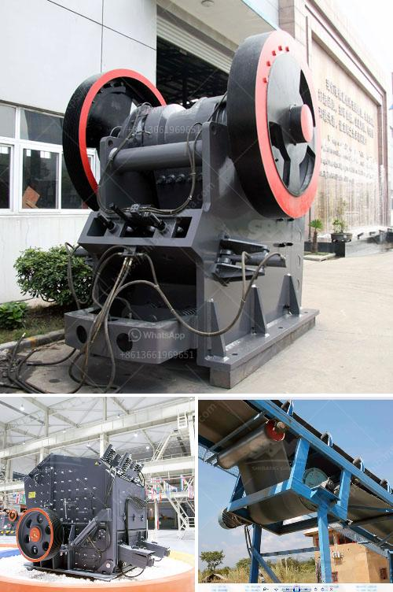

<h3>conveyor belt price per foot</h3>
When it comes to purchasing a conveyor belt, one of the major factors that often sway buyers' decisions is the price per foot of the belt. Understanding the price per foot is essential as it helps buyers compare different options, evaluate their budget, and make an informed decision. However, the price per foot of a conveyor belt can vary significantly depending on several factors. This article aims to explore these factors and provide a comprehensive understanding of conveyor belt pricing.

One of the primary factors that affect the price per foot of a conveyor belt is its material composition. Conveyor belts are available in various materials, including rubber, fabric, metal, and plastic. Each material has its unique properties, durability, and applications, and hence it affects the overall price. For instance, rubber belts are commonly used due to their high tensile strength and resistance to wear and tear, and they generally have a higher price compared to plastic or fabric belts. Understanding your specific application requirements can help in selecting the appropriate material composition and determine the corresponding price per foot.

The width and length of a conveyor belt play a crucial role in determining its price per foot. Conveyor belts come in different standard widths, typically ranging from 12 to 48 inches, and can be customized to fit specific needs. The wider the belt, the higher the price per foot, due to the increased material required for manufacturing. Additionally, the length of the belt also affects the overall cost. Longer conveyor belts naturally cost more than shorter ones, as they require more material and manufacturing processes. It is important to carefully assess your operation's requirements to strike the right balance between cost and functionality.

Conveyor belts can be tailored with several special features to enhance their functionality and durability. These features often come at an additional cost and can influence the price per foot. For example, features like cleats, sidewalls, and tracking guides are commonly added to conveyor belts to facilitate easy transportation of specific goods. These additions increase the customizability, complexity, and price of the belt. While it is essential to evaluate your unique requirements, one must consider the additional cost implications of these special features.

The conveyor belt industry is highly competitive, with numerous suppliers offering different pricing structures. It is essential to consider the reputation and reliability of the supplier before making a purchasing decision, as it can influence the cost per foot as well as the overall quality of the belt. While it may be tempting to opt for the cheapest option, compromising on quality can lead to frequent breakdowns, reduced productivity, and higher maintenance costs in the long run. It is advisable to gather feedback, research different suppliers, and strike a balance between price and quality.

In conclusion, the price per foot of a conveyor belt is influenced by several factors, including material composition, belt width and length, special features, and the reputation of the supplier. It is crucial for buyers to evaluate their requirements, compare quotes from different suppliers, and make an informed decision based on their budget and operational needs. By understanding the factors affecting conveyor belt pricing, buyers can ensure that they obtain the right conveyor belt solution at a fair price.
<h3>Contact us</h3><ul><li><strong>Whatsapp:&nbsp;<a href="https://wa.me/8613661969651">+8613661969651</a></strong></li><li><a href="https://swt.shibang-china.com/?git&amp;zhl&amp;conveyor belt price per foot"><strong>Online Service(chat now)</strong></a></li></ul><h3>Related</h3><ul><li><a href='buy 450 kw stone crusher.md'>buy 450 kw stone crusher</a></li><li><a href='used chrome ore mining crushing equipment crusher.md'>used chrome ore mining crushing equipment crusher</a></li><li><a href='feasibility study of palm kernel crushing plant.md'>feasibility study of palm kernel crushing plant</a></li><li><a href='crushing plant suppliers in pakistan.md'>crushing plant suppliers in pakistan</a></li><li><a href='ball mill price list philippines.md'>ball mill price list philippines</a></li></ul>