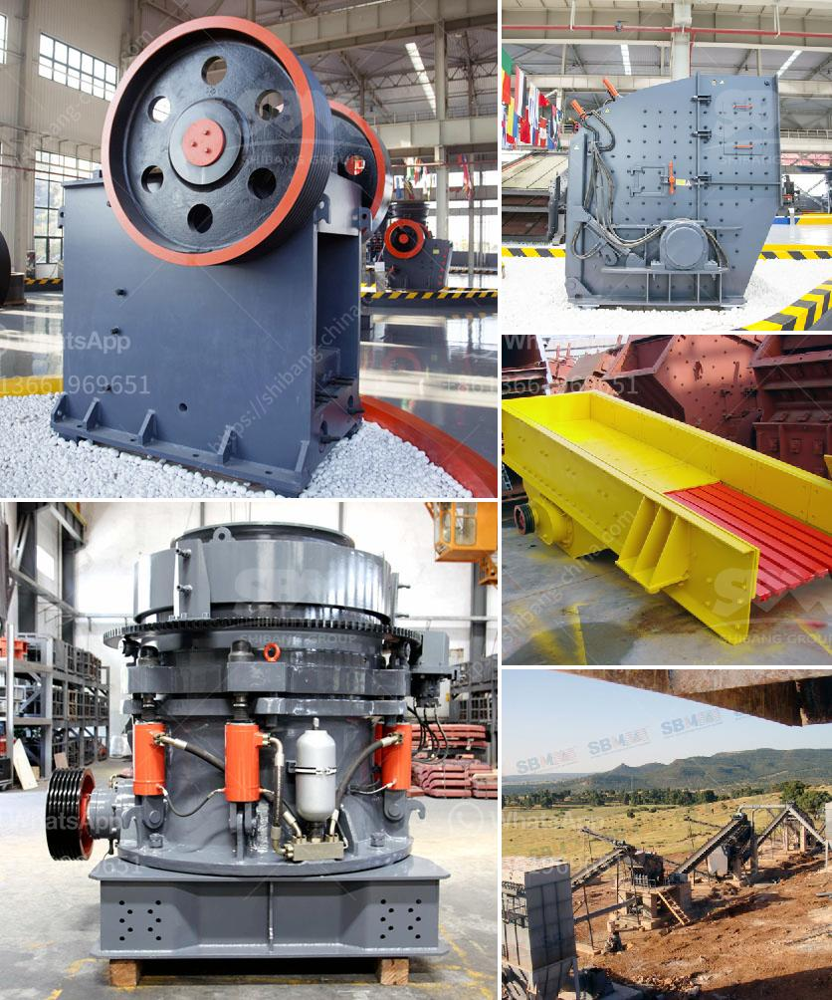

<h3>conveyor belt prices malaysia</h3>
Recently, there has been a significant increase in the prices of conveyor belts in Malaysia. This is due to various factors such as the growing demand for these belts in industries like mining, construction, and manufacturing. Additionally, the rising cost of raw materials and the impact of inflation have also contributed to the surge in conveyor belt prices.

Conveyor belts have become an essential component in numerous industries as they facilitate the movement of materials and products efficiently and safely. With the advent of automation and advanced technologies, the demand for conveyor belts has only increased further. This has led to an upsurge in conveyor belt prices, as manufacturers face the challenge of meeting the growing demand while also dealing with economic fluctuations.

The cost of conveyor belts can vary depending on several factors, including the type of belt required, its length, width, and thickness, as well as the material used. There are different types of conveyor belts available in the market, such as flat belts, modular belts, magnetic belts, and chain belts, each with its specific use and price range.

In Malaysia, the prices of conveyor belts can range from RM10 to RM100 per meter for standard quality belts. However, for those seeking specialized belts with unique specifications, the prices can go up to RM500 per meter or more. This wide price range reflects the diverse requirements of industries and the varying quality of conveyor belts.

It is important for businesses in Malaysia to consider not only the upfront cost of conveyor belts but also their longevity and reliability. Cheaper belts may seem like a cost-effective option initially, but they may lack durability and require frequent repairs or replacements. On the other hand, investing in high-quality belts ensures smooth operations, reduces downtime, and minimizes long-term costs.

To find the best conveyor belt prices in Malaysia, it is recommended to reach out to reputable manufacturers and suppliers who offer a wide range of options and competitive pricing. They can also provide expert advice on selecting the most suitable conveyor belt for specific requirements, considering factors such as load capacity, environment, and material characteristics.

In conclusion, the increasing demand for conveyor belts in Malaysia, coupled with external factors such as rising raw material costs and inflation, has led to a surge in conveyor belt prices. It is crucial for businesses to carefully consider their requirements and invest in high-quality belts that offer longevity and reliability, as this ensures smooth operations and minimizes long-term costs. By partnering with reputable manufacturers and suppliers, businesses can find the best conveyor belt prices that suit their needs.
<h3>Contact us</h3><ul><li><strong>Whatsapp:&nbsp;<a href="https://wa.me/8613661969651">+8613661969651</a></strong></li><li><a href="https://swt.shibang-china.com/?git&amp;zhl&amp;conveyor belt prices malaysia"><strong>Online Service(chat now)</strong></a></li></ul><h3>Related</h3><ul><li><a href='conveyor belts in horizontal position.md'>conveyor belts in horizontal position</a></li><li><a href='crusher for sale egypt.md'>crusher for sale egypt</a></li><li><a href='3 roller raymond mill details process.md'>3 roller raymond mill details process</a></li><li><a href='sand screen with vibrator.md'>sand screen with vibrator</a></li><li><a href='crushed limestone for sale.md'>crushed limestone for sale</a></li></ul>