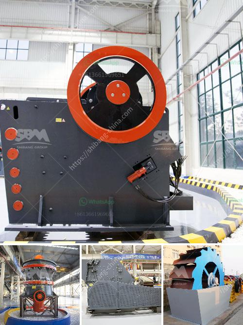

<h3>conveyor belt supplier in riyadh</h3>
Conveyor belts are an essential component of various industries, facilitating the seamless movement of materials and goods. In Riyadh, the bustling capital city of Saudi Arabia, there are several conveyor belt suppliers that cater to the diverse needs of industries such as manufacturing, logistics, and mining.

One prominent conveyor belt supplier in Riyadh is XYZ Company. With decades of experience in the industry, XYZ Company has established itself as a reliable and trusted supplier of conveyor belts. They offer an extensive range of conveyor belts, including PVC belts, rubber belts, and steel cord belts, suitable for different applications. From heavy-duty belts for mining operations to food-grade belts for the food industry, XYZ Company provides bespoke solutions to meet the unique requirements of each client.

Another notable conveyor belt supplier in Riyadh is ABC Industrial Supplies. Known for their exceptional customer service and high-quality products, ABC Industrial Supplies has built a strong reputation in the market. They offer an extensive range of conveyor belts, including modular belts, timing belts, and flat belts. With a team of experienced professionals, ABC Industrial Supplies provides comprehensive technical support and maintenance services to ensure the optimal performance of conveyor belts.

In addition to XYZ Company and ABC Industrial Supplies, there are other conveyor belt suppliers in Riyadh that cater to the specific needs of industries such as construction, automotive, and pharmaceuticals. These suppliers understand the importance of timely delivery and offer competitive pricing, making them the preferred choice for many businesses in Riyadh.

In conclusion, conveyor belts are a crucial component in various industries, and Riyadh is fortunate to have several reliable suppliers catering to the diverse needs of businesses. Whether it is for heavy-duty applications or specific industry requirements, conveyor belt suppliers in Riyadh ensure a seamless and efficient flow of materials, contributing to the growth and success of industries in the capital city of Saudi Arabia.
<h3>Contact us</h3><ul><li><strong>Whatsapp:&nbsp;<a href="https://wa.me/8613661969651">+8613661969651</a></strong></li><li><a href="https://swt.shibang-china.com/?git&amp;zhl&amp;conveyor belt supplier in riyadh"><strong>Online Service(chat now)</strong></a></li></ul><h3>Related</h3><ul><li><a href='mtw grinding mill.md'>mtw grinding mill</a></li><li><a href='chrome beneficiation plant china.md'>chrome beneficiation plant china</a></li><li><a href='trommel small mobile wash plants for sale.md'>trommel small mobile wash plants for sale</a></li><li><a href='operation and maintenance manuals of cone crusher.md'>operation and maintenance manuals of cone crusher</a></li><li><a href='ball mill projects for slag in india.md'>ball mill projects for slag in india</a></li></ul>