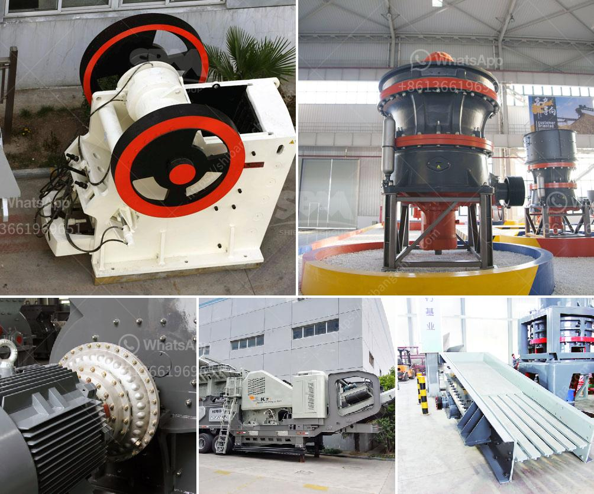

<h3>conveyor belts bogota</h3>
When it comes to the manufacturing industry, efficiency is the key to success. From automotive to food production, the need for a cost-effective and reliable solution to move materials and products throughout the production process is paramount. In Bogota, the capital city of Colombia, conveyor belts have emerged as a revolutionary tool that has transformed the manufacturing landscape.

Conveyor belts are essentially a continuous loop of material made from rubber, fabric, or metal that moves products or materials from one point to another. They have been used since the late 19th century when they were introduced in the coal mining industry. Over time, these belts have evolved and become an integral part of various industries, including manufacturing.

One of the significant advantages of conveyor belts is their ability to automate the production process, reducing the need for manual labor and increasing overall productivity. In Bogota, the manufacturing industry has seen an incredible surge in efficiency and cost-effectiveness since the implementation of conveyor belts. These machines have drastically cut down on manual handling, enabling manufacturers to meet increasing demands and streamline their operations.

Another significant benefit of conveyor belts is their versatility. They can handle a wide range of products, from small components to heavy goods, with varying shapes and sizes. Additionally, conveyor belts can be customized to fit the specific needs of different industries and production lines. This adaptability has made them an essential tool in Bogota's diverse manufacturing landscape.

In a bustling city like Bogota, with a population of over seven million, a steady supply of goods and products is of utmost importance. Conveyor belts ensure a smooth and continuous flow of materials, reducing bottlenecks and the chances of production delays. As a result, manufacturers can meet the demands of consumers promptly and maintain a competitive edge in the market.

Furthermore, conveyor belts have proven to be a sustainable solution in the manufacturing industry. They minimize waste generation and energy consumption, making them an eco-friendly alternative to traditional manual handling methods. By optimizing the transportation of materials, conveyor belts reduce the risk of damage and thus decrease product waste. This not only benefits the environment but also saves manufacturers a substantial amount of money.

However, to ensure the success of conveyor belts in Bogota's manufacturing industry, regular maintenance and monitoring are essential. Malfunctions or breakdowns can disrupt the entire production process and lead to costly delays. Therefore, investing in proper training and employing skilled technicians to handle and maintain these machines is crucial.

Conveyor belts in Bogota have transformed the manufacturing industry, making production faster, more efficient, and cost-effective. These versatile tools streamline operations, improve productivity, and enable manufacturers to meet the increasing demands in a timely manner. Additionally, their sustainability features make them an attractive option for environmentally conscious companies.

As Bogota continues to grow as an industrial hub, the demand for conveyor belts is only expected to increase. From automakers to food processors, businesses across various industries have embraced this technology as a vital component of their production lines. The integration of conveyor belts in Bogota's manufacturing landscape is a testament to the city's commitment to progress and innovation.
<h3>Contact us</h3><ul><li><strong>Whatsapp:&nbsp;<a href="https://wa.me/8613661969651">+8613661969651</a></strong></li><li><a href="https://swt.shibang-china.com/?git&amp;zhl&amp;conveyor belts bogota"><strong>Online Service(chat now)</strong></a></li></ul><h3>Related</h3><ul><li><a href='small scale verticle grinding limestone machine.md'>small scale verticle grinding limestone machine</a></li><li><a href='supplier for crusher.md'>supplier for crusher</a></li><li><a href='used pioneer jaw crusher.md'>used pioneer jaw crusher</a></li><li><a href='cheapest crusher machines for sale in kenya.md'>cheapest crusher machines for sale in kenya</a></li><li><a href='sand making plant.md'>sand making plant</a></li></ul>