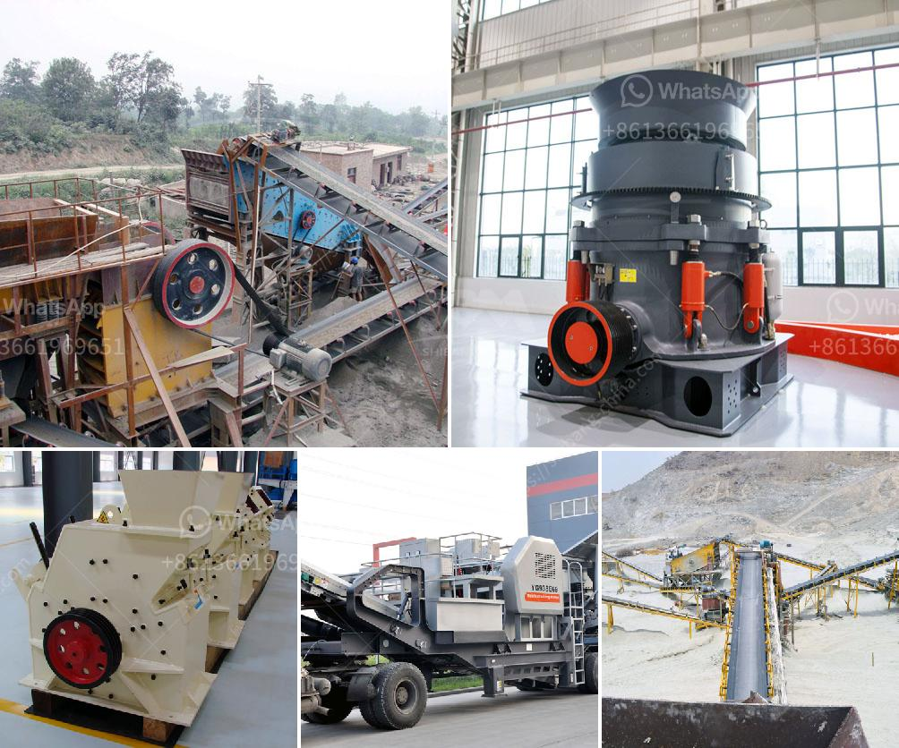

<h3>conveyor belts in horizontal position</h3>
Conveyor belts have revolutionized the way industries operate by efficiently transporting goods and materials from one point to another. While they are commonly associated with a vertical orientation, conveyor belts in a horizontal position also play a crucial role in various industries. This article will explore the functionality, benefits, and applications of conveyor belts in a horizontal position.

In a horizontal position, conveyor belts work by utilizing motorized pulleys or rollers that rotate and move the belt along a flat surface. These belts consist of a continuous loop made from durable materials like rubber, PVC, or metal. The movement of the belt is powered by a motor, allowing for the efficient transportation of goods.

One of the primary benefits of utilizing conveyor belts in a horizontal position is the ability to move items effortlessly across long distances. Whether it is in manufacturing facilities, warehouses, or distribution centers, conveyor belts help to streamline the transportation process. With the ability to handle heavy loads, conveyor belts ensure faster and more efficient movement of goods, reducing human effort and improving overall productivity.

The horizontal position of conveyor belts also allows for easy integration with other machines and equipment. For example, in factories, these belts can be seamlessly connected to various processing machines, such as sorters, packers, and labeling machines. This integration not only saves time but also minimizes the risk of errors or accidents during transportation.

Additionally, conveyor belts in a horizontal position offer a safer working environment. By automating the transportation process, workers are less exposed to manual labor risks, such as heavy lifting, pushing, or pulling. With the elimination of physical strain, organizations can reduce the chances of employee injuries, resulting in a more productive and efficient workforce.

The flexibility of conveyor belts in a horizontal position allows for the transportation of a wide range of goods and materials. This versatility makes them invaluable in industries such as mining, agriculture, automotive, and pharmaceuticals. From bulk materials like ores and grains to small-sized packages or delicate products, conveyor belts can handle a variety of items efficiently.

Furthermore, conveyor belts in a horizontal position can be customized to meet specific industry requirements. Adjustable speed controls, reversible belts, and variable widths are some of the features that can be incorporated, ensuring optimal performance. Additionally, the use of advanced technologies such as sensors and automated sorting systems enhances the efficiency of the transportation process.

In conclusion, conveyor belts in a horizontal position offer numerous advantages, making them a valuable asset in various industries. The efficiency, versatility, and safety they provide contribute to improved productivity and reduced operational costs. From manufacturing to warehousing, these belts streamline the transportation of goods while minimizing manual labor risks. With continued advancements in technology, conveyor belts in horizontal positions will continue to play a vital role in optimizing the movement of goods and materials.
<h3>Contact us</h3><ul><li><strong>Whatsapp:&nbsp;<a href="https://wa.me/8613661969651">+8613661969651</a></strong></li><li><a href="https://swt.shibang-china.com/?git&amp;zhl&amp;conveyor belts in horizontal position"><strong>Online Service(chat now)</strong></a></li></ul><h3>Related</h3><ul><li><a href='stone quarries crusher in uganda.md'>stone quarries crusher in uganda</a></li><li><a href='grinding raymond mill.md'>grinding raymond mill</a></li><li><a href='ball mill production capacity.md'>ball mill production capacity</a></li><li><a href='industrial hammer mill cost.md'>industrial hammer mill cost</a></li><li><a href='business plan on quarry crusher.md'>business plan on quarry crusher</a></li></ul>