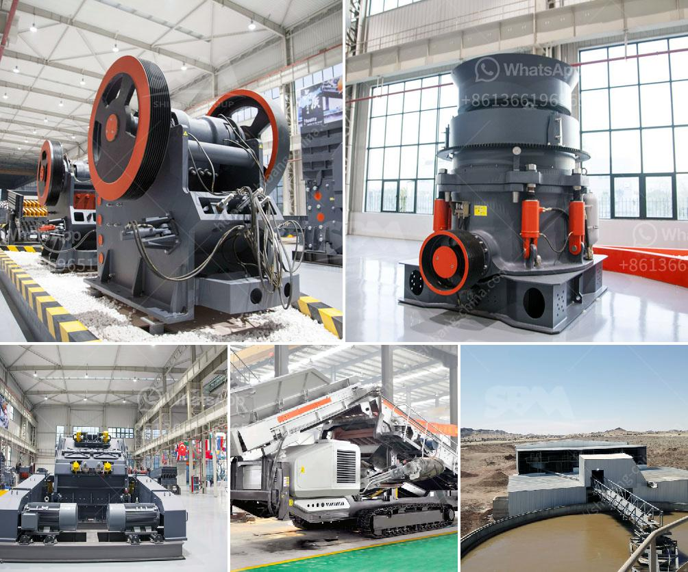

<h3>conveyor belts in merida</h3>
In recent years, the city of Merida has witnessed a significant growth in its industrial sector. One crucial component that has played a pivotal role in this progress is the use of conveyor belts. These belts have become the backbone of various industries, facilitating the movement of materials and goods efficiently and effectively. With their unmatched versatility and reliability, conveyor belts have revolutionized manufacturing processes across Merida.

One of the significant advantages of conveyor belts is their ability to handle a wide range of materials. Whether it's solid items, loose pieces, or liquids, these belts can smoothly transport them from one point to another, ensuring a continuous flow of production. From the food and beverage industry to the automotive sector, conveyor belts have found application in diverse fields, making them a crucial part of Merida's industrial growth.

In the food and beverage industry, conveyor belts have brought about significant improvements in the production and packaging processes. With the help of these belts, food items can be efficiently transported between different stages of production, reducing human error and increasing efficiency. Moreover, conveyor belts are designed to meet strict hygiene standards, ensuring the safety and quality of food products. This has greatly benefited Merida's food industry, allowing for increased output and improved product consistency.

Another industry that has greatly benefited from conveyor belts is the manufacturing sector. With the ability to handle heavy loads, these belts have streamlined the assembly line process, reducing manual labor and eliminating the risk of human injuries. Moreover, conveyor belts can be customized to suit specific manufacturing needs, whether it's the automotive, pharmaceutical, or construction industry. By automating the transportation of materials, conveyor belts have significantly increased production speed and efficiency in Merida's manufacturing plants.

The mining industry is yet another sector that has witnessed the impact of conveyor belts in Merida. With the city's rich mineral resources, the mining sector has experienced considerable growth. Conveyor belts have played a crucial role in the transportation of minerals and ores from mining sites to processing plants. These belts can withstand harsh conditions, such as extreme temperatures and abrasive materials, ensuring a reliable and continuous flow of mining output. In this way, Merida's mining industry has grown exponentially, attracting investments and contributing to the city's economic development.

Not only have conveyor belts improved industrial processes, but they have also positively impacted the environment. By reducing the need for extensive human manual labor and optimizing production processes, conveyor belts have minimized energy consumption and greenhouse gas emissions in Merida's industries. This sustainable approach has not only contributed to a cleaner environment but has also made the industries more cost-effective and competitive.

In conclusion, conveyor belts have become the backbone of Merida's industrial progress. With their ability to handle diverse materials, improve production processes, and ensure a continuous flow of goods, these belts have revolutionized the city's manufacturing, food, and mining sectors. Their versatility and reliability, coupled with their positive environmental impact, make conveyor belts an indispensable tool for the industries in Merida. As the city continues to grow, the importance of conveyor belts will only continue to increase, fueling further progress in Merida's industrial sector.
<h3>Contact us</h3><ul><li><strong>Whatsapp:&nbsp;<a href="https://wa.me/8613661969651">+8613661969651</a></strong></li><li><a href="https://swt.shibang-china.com/?git&amp;zhl&amp;conveyor belts in merida"><strong>Online Service(chat now)</strong></a></li></ul><h3>Related</h3><ul><li><a href='marcasite ball mill.md'>marcasite ball mill</a></li><li><a href='mobile crusher indonesia hire mines crusher for sale.md'>mobile crusher indonesia hire mines crusher for sale</a></li><li><a href='crushing plant company.md'>crushing plant company</a></li><li><a href='manganese limestone processing unit.md'>manganese limestone processing unit</a></li><li><a href='used gold stamp mill for sale in south africa.md'>used gold stamp mill for sale in south africa</a></li></ul>