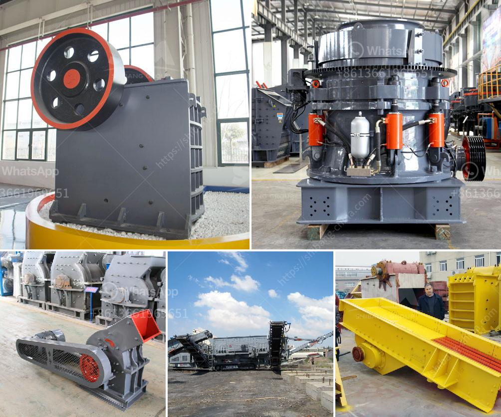

<h3>conveyor belts in south africa</h3>
Conveyor belts are used in a wide range of industries for transporting goods and materials efficiently and safely. Conveyor belts in South Africa are highly advanced and competitive, offering excellent performance in moving a variety of goods. These belts are also durable and can withstand harsh working conditions, making them ideal for various industries in the country.

One of the key industries that benefit from conveyor belts in South Africa is the mining industry. As the world’s leading producer of precious and industrial minerals, South Africa is home to many lucrative mining operations. Conveyor belt systems are an integral part of these mines as they help transport extracted materials from the mining site to the processing plants. They have revolutionized the mining industry by increasing productivity and reducing labor costs. With the help of conveyor belts, large quantities of mineral ores, coal, and other materials can be transported quickly, ensuring efficient production and processing.

Another industry that extensively utilizes conveyor belts is the agricultural sector. South Africa is known for its vast agricultural lands, producing a wide range of crops and livestock. Conveyor belts are commonly used in agricultural processing plants, helping to transport produce, grains, and animal feed. These belts are designed to handle heavy loads and can transport materials long distances reliably. They help speed up the sorting, packaging, and distribution processes in the agricultural industry, ensuring fresh produce reaches consumers in a timely manner.

The manufacturing industry in South Africa also heavily relies on conveyor belts. A wide range of products, including automotive parts, electronics, and appliances, are produced in the country. Conveyor belts play a critical role in automating the manufacturing processes and improving efficiency. They are used for moving raw materials to different stages of production, as well as for packaging and shipping finished goods. By automating these processes, conveyor belts contribute to higher production rates and improved quality control, resulting in increased profitability for manufacturers.

The logistics and warehousing industry also benefits greatly from conveyor belts. South Africa has a vast transportation network, with goods moved across the country and globally. Conveyor belts are used in warehouses and distribution centers to sort, package, and move goods quickly and efficiently. These belts can handle a wide range of products, from small packages to heavy pallets, making them essential for logistics operations. Conveyor belts not only save time and labor but also reduce the risk of damage or loss during the handling and transportation process, ensuring goods are delivered intact.

In conclusion, conveyor belts play a crucial role in various industries in South Africa. From mining to agriculture, manufacturing, and logistics, these belts ensure the smooth and efficient movement of goods and materials. They have revolutionized industrial processes, increasing productivity, reducing labor costs, and improving overall operational efficiency. With advanced technology and durable construction, conveyor belts in South Africa continue to evolve and meet the changing needs of industries, contributing to the country's economic growth and development.
<h3>Contact us</h3><ul><li><strong>Whatsapp:&nbsp;<a href="https://wa.me/8613661969651">+8613661969651</a></strong></li><li><a href="https://swt.shibang-china.com/?git&amp;zhl&amp;conveyor belts in south africa"><strong>Online Service(chat now)</strong></a></li></ul><h3>Related</h3><ul><li><a href='roller crusher brick making machine.md'>roller crusher brick making machine</a></li><li><a href='crusher pirdra crusher puedra.md'>crusher pirdra crusher puedra</a></li><li><a href='used chrome ore mining crushing equipment crusher.md'>used chrome ore mining crushing equipment crusher</a></li><li><a href='jaw crusher in kenya.md'>jaw crusher in kenya</a></li><li><a href='50 tph raymond mills.md'>50 tph raymond mills</a></li></ul>