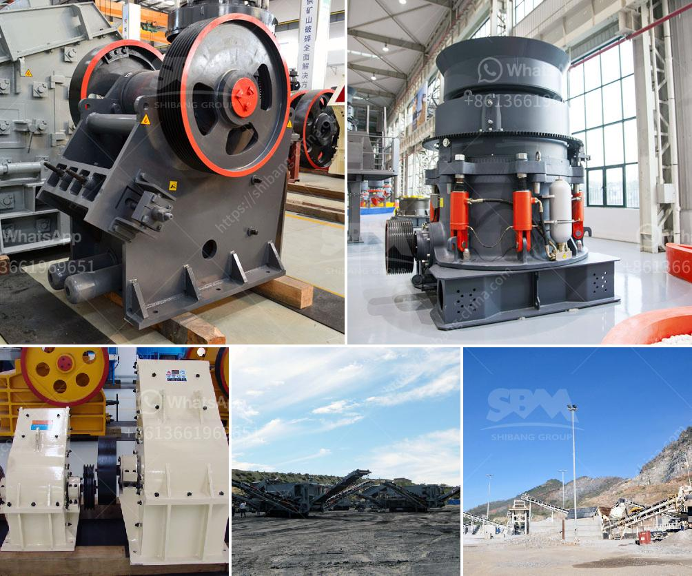

<h3>conveyor belts manufactures</h3>
Conveyor belts are omnipresent in our daily lives, although we might not always realize their significance. Whether at airports, factories, mines, or supermarkets, conveyor belts play a critical role in ensuring the smooth and efficient movement of goods, materials, and people. Behind these vital tools are conveyor belt manufacturers, responsible for designing, producing, and maintaining these essential components of modern life.

Conveyor belt manufacturers are specialized companies that produce, test, and supply these belts to a multitude of industries worldwide. They play a pivotal role in ensuring the proper functioning of industrial processes, from material handling to assembly lines, as well as enabling large-scale distribution and logistics operations.

The process of manufacturing conveyor belts requires expertise, precision, and meticulous attention to detail. The manufacturers start by selecting the appropriate materials based on the specific requirements of the industry they serve. Factors such as temperature, chemical resistance, load capacity, and belt speed are carefully considered to ensure longevity and durability.

There are various types of conveyor belts, each designed for different applications. Manufacturers tailor-make their products to suit industries such as mining, agriculture, food processing, packaging, and automotive assembly lines. From heavy-duty belts used in mining operations to belts with specialized coatings for food-grade applications, conveyor belt manufacturers are capable of catering to a wide array of needs.

The manufacturing process typically involves several key steps. First, the chosen materials are combined and shaped into a continuous belt through state-of-the-art machinery. Precision is vital here, as the belt's dimensions must be consistent and meet the industry's standards. Once the base belt is ready, manufacturers add specialized features such as cleats, sidewalls, or perforations, depending on the specific application.

The final step in the manufacturing process is quality testing. Conveyor belt manufacturers subject their products to rigorous testing to ensure they meet the highest standards of quality and performance. This includes testing for factors such as tensile strength, resistance to abrasion, durability, and flexibility. Only belts that pass these stringent tests are deemed fit for use in various industries.

Maintenance and after-sales service are also crucial aspects of the conveyor belt manufacturing industry. Manufacturers provide support to their customers by offering installation services, regular maintenance, and prompt troubleshooting. This proactive approach allows businesses to minimize downtime and maximize the lifespan of their conveyor belts, ultimately enhancing productivity and overall efficiency.

In recent years, conveyor belt manufacturers have embraced technological advancements in their industry. Automation and robotics have revolutionized the manufacturing process, leading to increased efficiency and precision. Additionally, manufacturers have been leveraging new materials and coatings to enhance the performance and longevity of their belts.

The conveyor belt manufacturing industry plays a pivotal role in various sectors, enabling the seamless flow of goods and materials. As industries continue to evolve and become more reliant on automated processes, conveyor belt manufacturers must continue to innovate and adapt to meet the ever-growing demands of modern society.

In conclusion, conveyor belt manufacturers are the unsung heroes behind the efficient movement of goods and materials across industries worldwide. Their expertise, precision, and dedication to quality ensure that businesses can rely on these essential tools for years to come. As technologies evolve and industries advance, so too will conveyor belt manufacturers, continuously striving to keep the world moving forward.
<h3>Contact us</h3><ul><li><strong>Whatsapp:&nbsp;<a href="https://wa.me/8613661969651">+8613661969651</a></strong></li><li><a href="https://swt.shibang-china.com/?git&amp;zhl&amp;conveyor belts manufactures"><strong>Online Service(chat now)</strong></a></li></ul><h3>Related</h3><ul><li><a href='stone crusher machine for rent or lease india.md'>stone crusher machine for rent or lease india</a></li><li><a href='ball mill grinding.md'>ball mill grinding</a></li><li><a href='jaw crusher prices saudi.md'>jaw crusher prices saudi</a></li><li><a href='ball mill for sale in china.md'>ball mill for sale in china</a></li><li><a href='stone stone crusher machine malaysia.md'>stone stone crusher machine malaysia</a></li></ul>