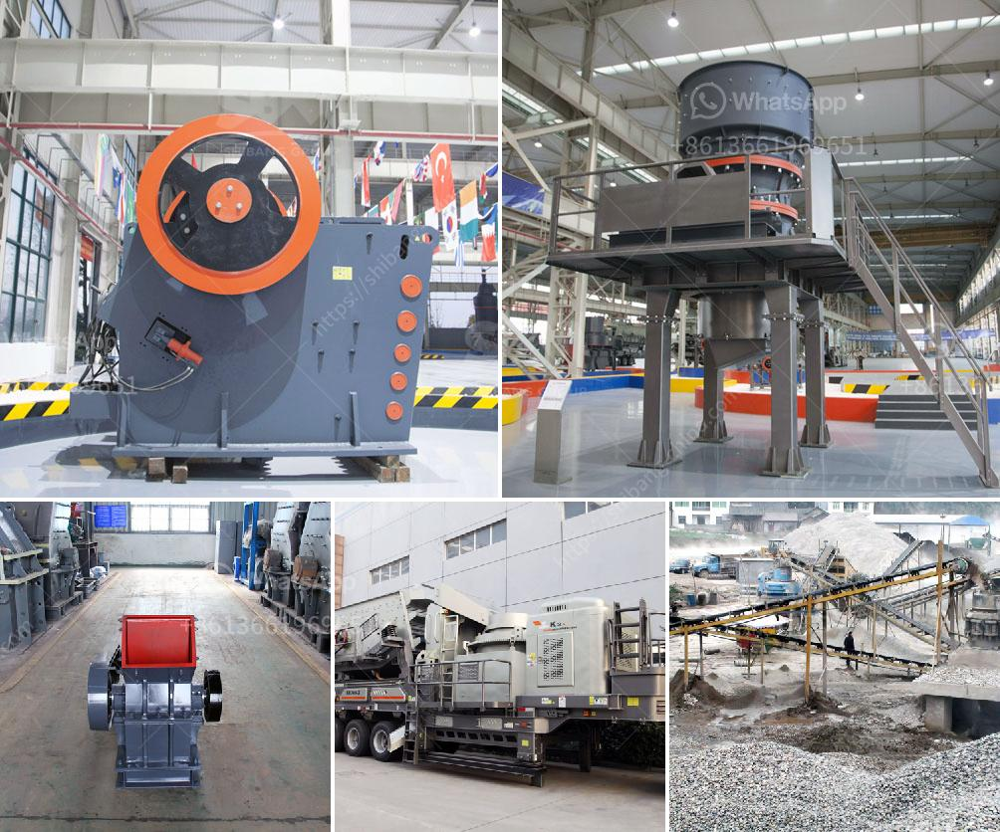

<h3>copper crusher exporter in south africa</h3>
South Africa plays a vital role in the global copper mining industry. Copper is a critical metal that is essential for various industrial applications, including electrical wiring, telecommunications, machinery, and transportation. With the abundance of copper deposits in the country, South Africa has become a significant exporter of this valuable resource. Among the leading players in this industry is the copper crusher exporter in South Africa.

The copper crusher exporter in South Africa crusher produces several series ore crushers, of which cone crusher and mobile crusher fits for processing the ore best. Exporters of copper ore in South Africa undergo vigorous screening processes to determine their credibility and reputation in the marketplace. The exporter must demonstrate a commitment to ethical mining practices, environmental sustainability, and adherence to international standards.

The copper crusher exporter in South Africa provides various types of crushers in the copper mining industry, including jaw crusher, cone crusher, impact crusher, hammer crusher, and mobile crusher. Each of these crusher machines has different specifications and can be applied in different industries.

The copper crusher exporter in South Africa aims to ensure that the copper ore extracted from the ground is processed efficiently and cost-effectively. It is crucial for the exporter to partner with mining companies in South Africa that have state-of-the-art technology and equipment for crushing, milling, and smelting operations.

In addition to the primary crushers, the copper crusher exporter in South Africa also offers secondary and tertiary crushing solutions, which can be custom-designed to meet specific requirements. These crushers play a crucial role in reducing the size of the copper ore particles to facilitate efficient transportation and processing.

South Africa is blessed with abundant copper reserves, making it a significant player in the global copper mining industry. The copper crusher exporter in South Africa is dedicated to continuously improving the efficiency and effectiveness of copper ore mining and processing operations.

With the support of advanced technology and equipment, the copper crusher exporter in South Africa aims to contribute to the growth and development of the global copper market. By exporting high-quality copper ore, South Africa plays a vital role in meeting the increasing global demand for this essential metal.
<h3>Contact us</h3><ul><li><strong>Whatsapp:&nbsp;<a href="https://wa.me/8613661969651">+8613661969651</a></strong></li><li><a href="https://swt.shibang-china.com/?git&amp;zhl&amp;copper crusher exporter in south africa"><strong>Online Service(chat now)</strong></a></li></ul><h3>Related</h3><ul><li><a href='crushing plant suppliers in pakistan.md'>crushing plant suppliers in pakistan</a></li><li><a href='mobile jaw crusher for sale south africa.md'>mobile jaw crusher for sale south africa</a></li><li><a href='screening and crushing solutions.md'>screening and crushing solutions</a></li><li><a href='2nd hand old mining process plant.md'>2nd hand old mining process plant</a></li><li><a href='start up granite quarry crusher business.md'>start up granite quarry crusher business</a></li></ul>