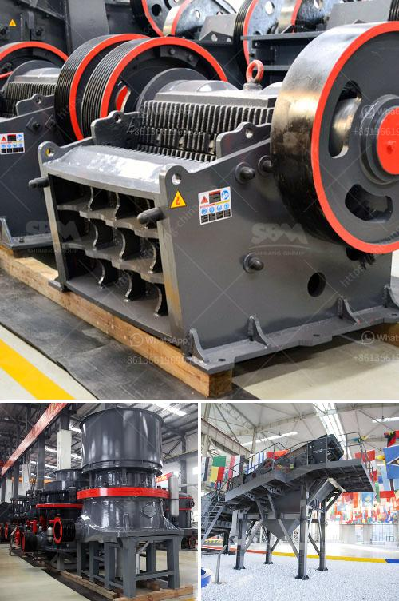

<h3>copper crusher manufacturer</h3>
Copper is an essential metal used in the construction industry. It is primarily used to make electrical wires, plumbing pipes, and roofing materials. As the demand for copper continues to rise, so does the need for efficient copper processing machinery. This is where copper crusher manufacturers come into play.

Copper crushers have been designed to crush copper ores into smaller particles for further processing. A copper crusher typically takes the form of a cone crusher or jaw crusher, which is used to break down copper ore into smaller particles. These machines have become indispensable in the mining industry, where the extraction of copper from ore is a time-consuming process that requires high levels of precision.

One of the most reputable copper crusher manufacturers in the market is Hongxing Machinery. Hongxing Machinery has been focusing on the research and development of copper crushers for many years. With more than 20 years of experience in this field, they have a wealth of expertise and knowledge. This has allowed them to produce high-quality copper crushers that meet the needs of their customers.

One of the main advantages of choosing Hongxing Machinery as your copper crusher manufacturer is their commitment to research and development. They have a dedicated team of engineers who constantly work on improving their products. This ensures that their copper crushers are always at the forefront of technology, making them more efficient and reliable.

Another key advantage of choosing Hongxing Machinery is their strong focus on customer satisfaction. They understand that every customer has unique requirements and strive to meet their specific needs. They offer a wide range of copper crushers, each designed to handle different types of copper ores. This allows customers to choose the crusher that best suits their particular application, ensuring optimal performance and efficiency.

In addition to their commitment to research and development, Hongxing Machinery also places great emphasis on quality control. They have a rigorous testing process in place to ensure that every copper crusher that leaves their facility meets the highest standards of quality. This attention to detail has earned them a reputation for producing reliable and durable machinery.

When it comes to copper crusher manufacturers, it is clear that Hongxing Machinery stands out from the competition. With their years of experience, commitment to research and development, focus on customer satisfaction, and strict quality control, they have become a trusted name in the industry. So, if you are in need of a copper crusher, look no further than Hongxing Machinery. They have the expertise and technological know-how to provide you with a high-quality and efficient solution.
<h3>Contact us</h3><ul><li><strong>Whatsapp:&nbsp;<a href="https://wa.me/8613661969651">+8613661969651</a></strong></li><li><a href="https://swt.shibang-china.com/?git&amp;zhl&amp;copper crusher manufacturer"><strong>Online Service(chat now)</strong></a></li></ul><h3>Related</h3><ul><li><a href='hammer crusher clinker.md'>hammer crusher clinker</a></li><li><a href='copper ore concentration processing.md'>copper ore concentration processing</a></li><li><a href='gold ore refinery portable machinery maker china.md'>gold ore refinery portable machinery maker china</a></li><li><a href='coal screen plant for hire in south africa.md'>coal screen plant for hire in south africa</a></li><li><a href='iron ore crusher in pakistan.md'>iron ore crusher in pakistan</a></li></ul>