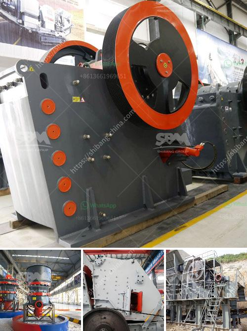

<h3>copper crusher plant for sale chile</h3>
Copper is one of the most important industrial metals in the world, and copper production has steadily increased over the past few decades. As a result, there is a high demand for copper crusher plants, especially in countries like Chile, which is one of the largest copper producers in the world.

Chile is known for its abundant copper reserves, with an estimated 200 million metric tons of accessible copper. This makes the country a major player in the copper industry, contributing to approximately 28% of the global copper production. With such vast resources, it is no wonder that Chile is home to several copper crusher plants.

A copper crusher plant is a machine designed to reduce large rocks into smaller rocks, gravel, or rock dust. It utilizes a metal surface to fracture or compress materials into small fractional chunks or denser masses. Copper crusher plants are used in various stages of the mining process to provide a consistent feed material for efficient crushing and grinding.

In Chile, copper crusher plants are widely used in the mining industry, especially in the copper mining process. The copper ore extracted from the mine is crushed into small pieces, then transported to a grinding mill for further processing. Through the grinding process, the copper ore is ground into a fine powder, which is then sent to flotation cells to separate the copper from other minerals.

One of the leading manufacturers of copper crusher plants in Chile is SBM. With over 20 years of experience, SBM has developed advanced technology to produce high-quality copper crusher plants. They offer a wide range of crushing plants, from primary crushers to tertiary and quaternary crushers, designed to meet the diverse needs of mining operations.

SBM's copper crusher plants are known for their reliability, efficiency, and high productivity. They are equipped with advanced features such as hydraulic adjustment, overload protection, and automatic control systems, ensuring optimal performance and minimal downtime. Additionally, their modular design allows for easy installation and maintenance, adapting to different site conditions.

Furthermore, SBM provides comprehensive after-sales service and technical support to ensure the smooth operation of their copper crusher plants. Their team of experts is available to assist with installation, training, spare parts supply, and troubleshooting, guaranteeing a hassle-free experience for customers.

In conclusion, copper crusher plants play a crucial role in the mining industry, particularly in countries like Chile with abundant copper reserves. These plants are designed to crush and process copper ore for efficient extraction and production. With the increasing demand for copper, investing in a reliable and efficient copper crusher plant is essential for mining companies. SBM's copper crusher plants offer the latest technology and excellent after-sales support, making them a viable choice for those looking to enhance their copper mining operations.
<h3>Contact us</h3><ul><li><strong>Whatsapp:&nbsp;<a href="https://wa.me/8613661969651">+8613661969651</a></strong></li><li><a href="https://swt.shibang-china.com/?git&amp;zhl&amp;copper crusher plant for sale chile"><strong>Online Service(chat now)</strong></a></li></ul><h3>Related</h3><ul><li><a href='sand making plant.md'>sand making plant</a></li><li><a href='machine to crush stones for gold from germany.md'>machine to crush stones for gold from germany</a></li><li><a href='complete ore mining processing line.md'>complete ore mining processing line</a></li><li><a href='operating parameter of vertical roller mill.md'>operating parameter of vertical roller mill</a></li><li><a href='materials for assembling a stone crusher.md'>materials for assembling a stone crusher</a></li></ul>