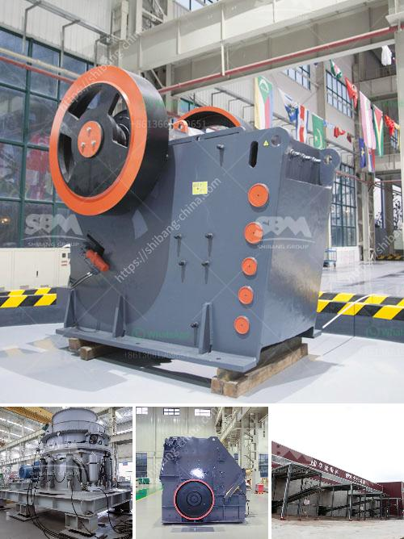

<h3>copper crusher pressure gauge manufacturer</h3>
Copper is an interesting metal used in many fields ranging from plumbing to electronics, and manufacturing of various household items. Copper has a reddish brown color and is known for its high thermal and electrical conductivity. It is commonly used to make electrical wires, plumbing pipes, and is even present in many household appliances.

One lesser-known application of copper is its use in manufacturing a device known as a copper crusher pressure gauge. Copper is a soft metal that can easily be crushed and thus, formed into various shapes and sizes. Copper is also known for its high ductility or the ability to stretch without breaking, which makes it an ideal material for making pressure gauges.

The copper crusher gauge is a device that measures the pressure inside the cartridge chamber of the firing chamber in a firearm or ammunition. This device is used to make sure that the firearm is safe to use and can handle different types of ammunition. The pressure is measured in terms of pounds per square inch (psi) and is determined by the amount of force exerted on the copper crusher gauge.

A copper crusher gauge holder is mounted within the barrel of a firearm and is linked to a piston and piston rod arrangement for positioning against a firing chamber. Copper crusher gauges are the traditional means to routinely determine peak pressures in large caliber weapons. Most attractive in this method is its simplicity in use. Questionable is the precision in reading the pressure in view of the cumbersome gauge calibration practice which is prone to errors, especially in the low temperature regime.

Each of these has its own unique features and benefits, but most of them exhibit more or less the same characteristics. The copper crusher pressure gauge is their time-proven, most reliable method of ammunition pressure measurement used by ammunition manufacturers worldwide.

Different configurations of copper crusher gauges are used to measure the pressure inside the barrel during gun firing. They can be placed on the chamber or on the barrel, depending on the manufacturer's preferences. The copper crusher gauges tend to be inexpensive because they are made from a single sheet of copper, which is mechanically formed into shape. At present, the copper crusher gauge manufacturers of the world are the United States and Germany. Their combined annual production can reach 200 million, accounting for 60% of the total international market.

Copper crusher gauges are proud to have installed their oil-free Copper Crusher Gauges in more than 400 universities and engineering schools worldwide. Their products are manufactured from high-quality materials and undergo extensive testing to ensure their durability. Copper crusher gauge holders are fully tested and referenced before purchase to meet the highest European quality standards. They are an essential part of any professional shooting range and are widely used by police and military forces worldwide.

In conclusion, copper crusher gauges are a useful tool for firearms manufacturers and users. They ensure that the firearm is safe to use and can withstand different pressures. The copper crusher pressure gauge manufacturer is a trusted source for pressure measurements in the firearms industry. Tips: Take caution while selecting the right manufacturer for your needs, and consider asking for testing certificates and references to ensure they are a reliable supplier.
<h3>Contact us</h3><ul><li><strong>Whatsapp:&nbsp;<a href="https://wa.me/8613661969651">+8613661969651</a></strong></li><li><a href="https://swt.shibang-china.com/?git&amp;zhl&amp;copper crusher pressure gauge manufacturer"><strong>Online Service(chat now)</strong></a></li></ul><h3>Related</h3><ul><li><a href='clay crusher machine.md'>clay crusher machine</a></li><li><a href='how to set up a crushing plant.md'>how to set up a crushing plant</a></li><li><a href='clay beneficiation process.md'>clay beneficiation process</a></li><li><a href='quarry stone crusherequipment.md'>quarry stone crusherequipment</a></li><li><a href='5mm limestones grinding to powder.md'>5mm limestones grinding to powder</a></li></ul>