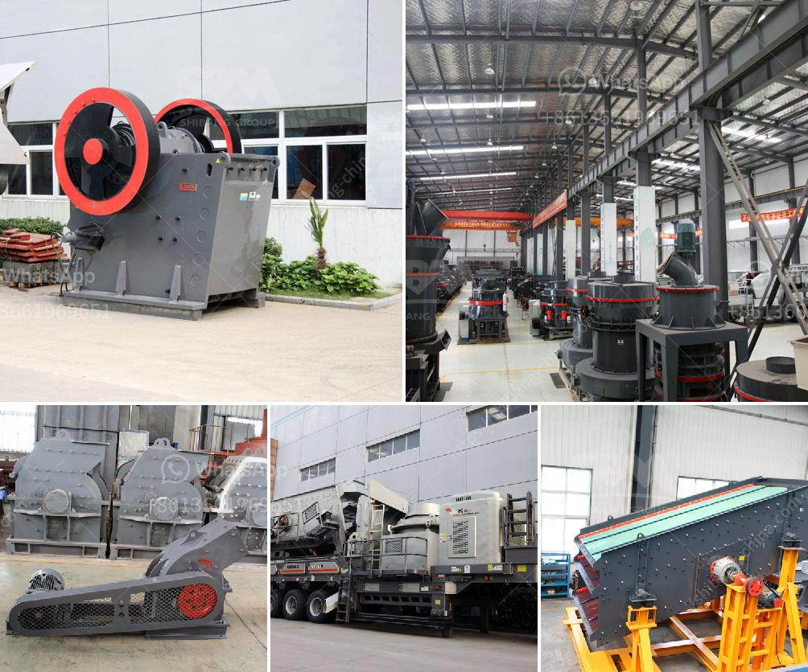

<h3>copper mining machine</h3>
The mining industry has been pivotal in the development of civilizations, underpinning the technological advancements we rely on today. One key component of this industry is the mining of copper, a vital metal used in a wide array of products that serve many sectors of the economy. However, copper mining comes with its own set of challenges and machinery is needed to tackle them. This is where the copper mining machine comes into play.

Copper mining has been a major industry in many countries throughout the world. Compression crusher technology for your mining aggregate/cement needs field. Copper extraction refers to the methods used to obtain copper from its ores. The conversion of copper consists of a series of physical and electrochemical processes. Methods have evolved and vary with country depending on the ore source, local environmental regulations, and other factors.

As with any industrial process, mining copper requires a vast amount of machinery to ensure the extraction process is efficient and accurate. From excavators and crushers to conveyor belts and vehicles, the machinery used in mining is constantly evolving and improving to keep up with the demanding requirements for copper extraction.

One of the most important pieces of machinery in the copper mining industry is the copper mining machine, which transports massive amounts of copper ore to various processing points. Copper extraction is a difficult process that requires heavy-duty machinery. The copper mining machine has brought groundbreaking changes to the mining industry, as it is capable of extracting copper from large open-pit mines, efficiently, safely, and swiftly.

The copper mining machine is highly effective and requires minimal maintenance, proving to be a robust and reliable machine in the mining industry. Copper mining results in the extraction of pure copper from copper ore. Many studies have shown that copper mining has immense benefits for economies. Moreover, due to its various industrial applications, copper is a crucial component of the machinery used in the mining process.

In recent years, there have been significant advancements in mining technology to enable faster and more efficient extraction of copper. These improvements have been primarily focused on reducing the environmental impact of copper mining, as well as increasing the safety and productivity of the mining process. The copper mining machine plays a vital role ensuring all these advancements come to fruition.

However, as with any industrial machinery, there are challenges that need to be addressed in the design and operation of a copper mining machine. The harsh conditions in mining environments, such as high temperatures, dust, and vibration, put excessive strain on the equipment. To withstand these conditions, the copper mining machine must be designed with durability and reliability in mind.

Additionally, safety is a paramount concern in the mining industry, and therefore, it is crucial that the copper mining machine is equipped with the necessary safety features to protect workers and prevent accidents. This includes ergonomic designs, advanced sensors, and effective ventilation systems.

In conclusion, the copper mining machine has revolutionized the mining industry, allowing for efficient and safe extraction of copper from open-pit mines. This machinery is an invaluable asset to the mining industry as it reduces the reliance on manual labor and increases productivity and efficiency. Furthermore, it ensures the sustainability of copper mining by minimizing the environmental impact and promoting safety in the workplace. As technology continues to evolve, so will the copper mining machine, shaping the future of copper extraction for generations to come.
<h3>Contact us</h3><ul><li><strong>Whatsapp:&nbsp;<a href="https://wa.me/8613661969651">+8613661969651</a></strong></li><li><a href="https://swt.shibang-china.com/?git&amp;zhl&amp;copper mining machine"><strong>Online Service(chat now)</strong></a></li></ul><h3>Related</h3><ul><li><a href='quarry crusher in kenya.md'>quarry crusher in kenya</a></li><li><a href='coconut shell powder making machine grinding mill for sale.md'>coconut shell powder making machine grinding mill for sale</a></li><li><a href='used carbon grinding production line.md'>used carbon grinding production line</a></li><li><a href='talc grinding mills usa.md'>talc grinding mills usa</a></li><li><a href='ball mills mfg in kenya.md'>ball mills mfg in kenya</a></li></ul>