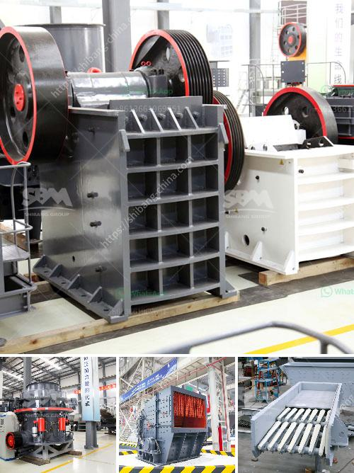

<h3>copper ore concentration processing</h3>
Copper ore concentration processing is a crucial step in the extraction and refining process of copper ore. From crushing and grinding of the ore to the separation of the copper minerals, the process encompasses several steps that allow for the extraction of pure copper metal efficiently.

The first step in copper ore concentration processing is crushing and grinding, where the rock ore is reduced in size by mechanical rock breakers. Once the ore is crushed into smaller particles, it is then sent to the grinding circuit where it is ground to a fine powder.

The grinding process helps liberate the copper minerals from the surrounding gangue materials. During grinding, chemicals known as flotation reagents are added to the ore slurry. These reagents help in selectively attaching to the copper minerals and making them hydrophobic, or water-repellent.

The next step in copper ore concentration processing is flotation. The ground ore slurry is mixed with water and aerated in flotation cells. The hydrophobic copper minerals attach to air bubbles as they rise to the surface of the flotation cells, forming a froth layer. This froth is then skimmed off, carrying the copper minerals with it. The froth, containing copper concentrate, is then dried and sent for further processing.

After flotation, the copper concentrate is further processed through a process called smelting. Smelting involves heating the concentrate in a furnace at high temperatures. This process helps remove impurities from the copper concentrate, such as sulfur, iron, and other metals. The result is the production of blister copper, which is over 98% pure copper.

The blister copper is then subjected to a refining process called electrorefining. In this process, the blister copper is placed in an electrolytic cell with a cathode made of pure copper. When an electric current is passed through the cell, copper from the blister copper plates onto the pure copper cathode, while impurities settle at the bottom of the cell as anode slimes. The resulting copper cathodes are then melted and cast into ingots or used to produce copper wire, rods, or other copper products.

Copper ore concentration processing is a complex process that involves multiple steps to ensure the extraction of pure copper. Each step, from crushing and grinding to flotation and smelting, plays an important role in producing high-quality copper concentrate. Furthermore, advancements in technology have allowed for more efficient and cost-effective processing methods, reducing the environmental impact of copper mining.

In conclusion, copper ore concentration processing is a critical stage in the extraction and refining of copper. Through crushing, grinding, flotation, smelting, and electrorefining, copper ore is transformed into high-quality copper concentrate, which serves as the basis for the production of various copper products. With technological advancements, the processing methods have become more efficient and environmentally friendly, ensuring a sustainable copper industry.
<h3>Contact us</h3><ul><li><strong>Whatsapp:&nbsp;<a href="https://wa.me/8613661969651">+8613661969651</a></strong></li><li><a href="https://swt.shibang-china.com/?git&amp;zhl&amp;copper ore concentration processing"><strong>Online Service(chat now)</strong></a></li></ul><h3>Related</h3><ul><li><a href='conveyor belts bogota.md'>conveyor belts bogota</a></li><li><a href='ball mill for lead processing companies list.md'>ball mill for lead processing companies list</a></li><li><a href='stone crusher manufacturers in dhansura.md'>stone crusher manufacturers in dhansura</a></li><li><a href='gypsum mining crusher dubai.md'>gypsum mining crusher dubai</a></li><li><a href='price of a rock crusher.md'>price of a rock crusher</a></li></ul>