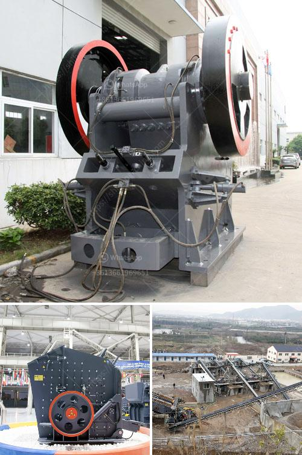

<h3>copper ore separation machine</h3>
Mineral processing plays a vital role in extracting valuable metals from their ores. Copper, a widely used metal in various industries, is extracted from its ore through a complex process that involves crushing, grinding, and separation. The efficiency of this process greatly depends on the use of cutting-edge technology and innovative equipment. One such breakthrough in mineral processing is the copper ore separation machine.

Copper ore separation machines are designed to remove unwanted impurities from copper ore by utilizing the differences in their magnetic properties. Through the use of magnets, these machines can efficiently separate copper particles from gangue, maximizing the purity and value of the final product.

The effectiveness and efficiency of copper ore separation machines are attributed to several key features. Firstly, these machines are equipped with powerful magnets that generate strong magnetic fields. These fields attract and separate the copper particles from the rest of the ore, ensuring a high concentration of copper in the final product. Additionally, the machines are constructed with robust materials that can withstand the harsh conditions of mineral processing, ensuring their durability and longevity.

Another crucial aspect of copper ore separation machines is their adaptability and versatility. These machines can handle a wide range of copper ore types, including low-grade and high-grade ores. This adaptability allows mining companies to process various ores without the need for significant modifications to the equipment, saving both time and costs.

Moreover, copper ore separation machines are designed with user-friendly interfaces and automation features, making them easy to operate. By incorporating advanced control systems, operators can monitor and adjust the machine settings, maximizing its performance and ensuring optimal separation efficiency. Automation also minimizes human error and improves safety in the working environment.

In recent years, technological advancements have further enhanced the capabilities of copper ore separation machines. For instance, some machines incorporate sensors and real-time data analysis algorithms to optimize the separation process. By continuously monitoring the ore composition and adjusting the machine settings accordingly, these advanced machines can maximize the recovery of copper and minimize the loss of valuable minerals.

Furthermore, several companies are investing in research and development to improve the efficiency and sustainability of copper ore separation machines. This includes exploring environmentally friendly and energy-efficient technologies that reduce the carbon footprint of the mineral processing industry. By minimizing energy consumption and optimizing the separation process, these innovations contribute to a more sustainable and responsible copper mining and processing industry.

In conclusion, copper ore separation machines have revolutionized the mineral processing industry by offering efficient and innovative solutions for extracting copper from its ores. Through the use of powerful magnets, adaptability, automation, and technological advancements, these machines ensure high separation efficiency and maximize the purity of the final copper product. Furthermore, ongoing research and development efforts aim to further improve the efficiency and sustainability of these machines, ensuring a brighter future for the copper mining industry.
<h3>Contact us</h3><ul><li><strong>Whatsapp:&nbsp;<a href="https://wa.me/8613661969651">+8613661969651</a></strong></li><li><a href="https://swt.shibang-china.com/?git&amp;zhl&amp;copper ore separation machine"><strong>Online Service(chat now)</strong></a></li></ul><h3>Related</h3><ul><li><a href='cost cement plant manufacturers and cost.md'>cost cement plant manufacturers and cost</a></li><li><a href='crushing plant company.md'>crushing plant company</a></li><li><a href='artificial stone production line floor.md'>artificial stone production line floor</a></li><li><a href='marble quarry mining in sudan.md'>marble quarry mining in sudan</a></li><li><a href='series capacitor for crushing plant.md'>series capacitor for crushing plant</a></li></ul>