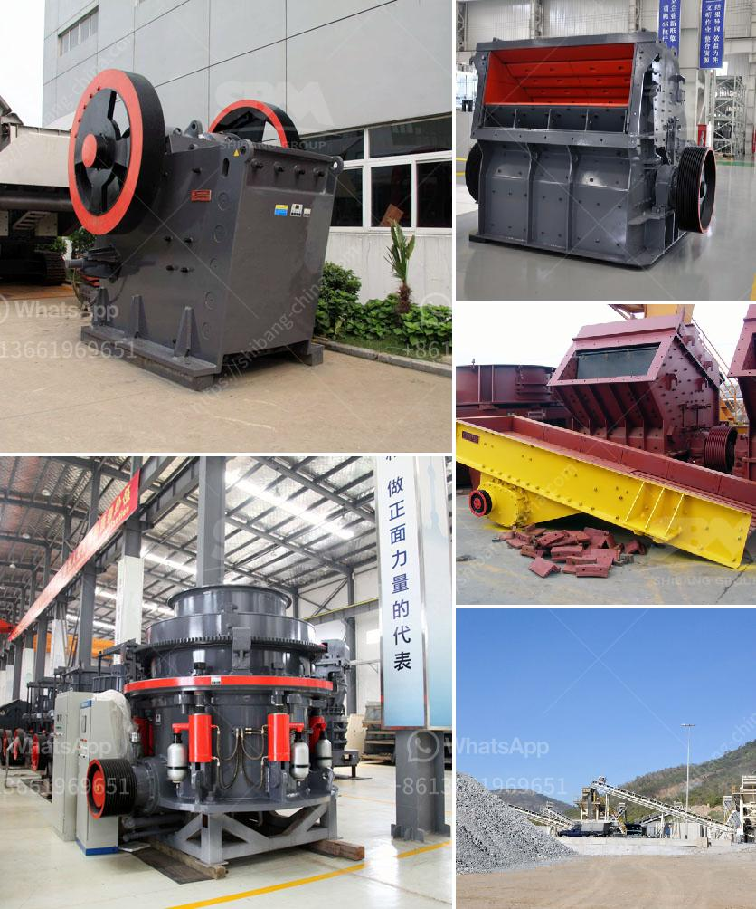

<h3>copper processing floatation plant</h3>
Copper is a widely used metal in various industries, including construction, electronics, and transportation. To obtain copper in its purest form, it undergoes a series of processes known as copper processing. One crucial step in this process is the copper processing flotation plant.

A copper processing flotation plant is a facility where copper ore is mechanically separated from waste rock and other impurities, using chemical and physical methods. The processed copper ore which is called copper concentrate, then undergoes smelting and refining processes to yield pure copper.

The flotation process in a copper processing flotation plant involves adding finely ground ore particles into water. This mixture is then agitated to create bubbles, to which copper minerals attach. The bubbles, along with the copper mineral particles, rise to the surface and form a froth layer. The froth, containing copper concentrate, is skimmed off the top and collected for further processing.

The flotation plant consists of several components that work together to ensure efficient separation of copper minerals from other impurities. One of the essential components is the flotation cell. This is where the flotation process takes place. The cell is a large tank filled with water and air. Inside the cell, there are rotating agitators and impellers that help to disperse the air bubbles throughout the cell and promote flotation.

Another critical component is the reagents used in the flotation process. Reagents are chemicals that selectively bind to the copper minerals, making them hydrophobic. Different types of reagents are added to the flotation cell to enhance the separation of copper minerals from other non-valuable minerals and impurities.

The flotation plant also includes various devices to control the flotation process. These devices help adjust the pH level, temperature, and chemical dosages to optimize the separation efficiency and copper recovery. The process control instruments and systems monitor and regulate these parameters, ensuring the flotation process operates smoothly.

The copper concentrate obtained from the flotation plant is then further processed through smelting and refining to obtain pure copper. Smelting involves heating the concentrate at high temperatures to separate the copper from other elements and impurities. Refining removes any remaining impurities, resulting in a high-quality copper product.

In conclusion, a copper processing flotation plant is a crucial step in the copper processing industry. It is responsible for separating copper minerals from waste rock and other impurities, resulting in copper concentrate. This concentrate is then smelted and refined to yield pure copper, which is used in various industries. The flotation plant consists of several components, including flotation cells, reagents, and process control devices, which work together to ensure efficient separation and copper recovery.
<h3>Contact us</h3><ul><li><strong>Whatsapp:&nbsp;<a href="https://wa.me/8613661969651">+8613661969651</a></strong></li><li><a href="https://swt.shibang-china.com/?git&amp;zhl&amp;copper processing floatation plant"><strong>Online Service(chat now)</strong></a></li></ul><h3>Related</h3><ul><li><a href='china crusher contact australia.md'>china crusher contact australia</a></li><li><a href='portable cedar rapids rock crusher.md'>portable cedar rapids rock crusher</a></li><li><a href='germany stone crusher.md'>germany stone crusher</a></li><li><a href='jaw crusher for sale in harare.md'>jaw crusher for sale in harare</a></li><li><a href='operating a granite quarry crusher in nigeria.md'>operating a granite quarry crusher in nigeria</a></li></ul>