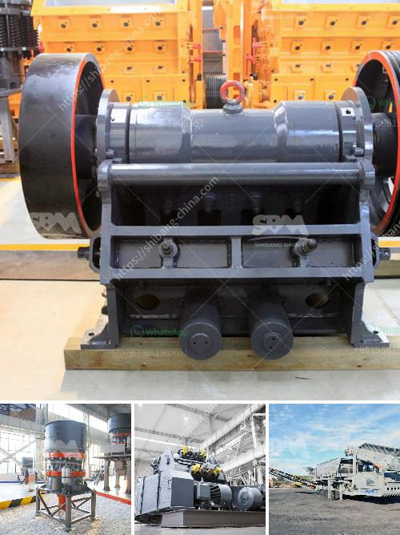

<h3>copper slag grinding machine in chennai</h3>
Copper is a valuable metal that has been widely used throughout history for various purposes. However, during the process of copper smelting and refining, a byproduct called copper slag is generated. This slag is usually disposed of as waste, but recent advancements in technology have made it possible to extract value from this material.

In Chennai, a city known for its vibrant manufacturing industry, the demand for copper slag grinding machines is on the rise. This is because industries such as construction, steel, and cement are increasingly recognizing the potential of copper slag as a substitute for traditional materials like sand and gravel.

One of the key advantages of copper slag is its high strength and durability. When ground into a fine powder, the slag can be used as a supplementary cementitious material in concrete production. This not only reduces the dependence on natural resources but also helps to enhance the overall strength and durability of the concrete.

Copper slag grinding machines in Chennai are designed to rationally crush and grind the copper slag into fine particles. These machines include jaw crushers, cone crushers, belt conveyors, vibrating screens, magnetic separators, and grinding mills to mention a few. They are capable of processing various types of copper slag, including granulated, air-cooled, and pelletized slag.

The use of copper slag grinding machines in Chennai has several environmental benefits as well. By utilizing the slag as a raw material, industries can reduce their carbon footprint and minimize the amount of waste sent to landfills. This supports the city's efforts to achieve sustainable development and combat climate change.

Furthermore, the utilization of copper slag can also contribute to cost savings for industries in Chennai. As a byproduct, copper slag is readily available and relatively inexpensive compared to other materials. By incorporating this material in their processes, industries can reduce production costs and increase profitability.

In conclusion, copper slag grinding machines in Chennai play a crucial role in extracting value from the waste generated during copper smelting and refining. These machines not only provide a sustainable solution for industrial waste management but also offer several benefits such as increased durability, cost savings, and reduced environmental impact. As the demand for sustainable building materials continues to grow, the copper slag grinding machine industry in Chennai is set to thrive.
<h3>Contact us</h3><ul><li><strong>Whatsapp:&nbsp;<a href="https://wa.me/8613661969651">+8613661969651</a></strong></li><li><a href="https://swt.shibang-china.com/?git&amp;zhl&amp;copper slag grinding machine in chennai"><strong>Online Service(chat now)</strong></a></li></ul><h3>Related</h3><ul><li><a href='20 ton peru mobile crushing plant.md'>20 ton peru mobile crushing plant</a></li><li><a href='used jaw crushers for sale in florida.md'>used jaw crushers for sale in florida</a></li><li><a href='build vibrating screen.md'>build vibrating screen</a></li><li><a href='coal screening machine in india.md'>coal screening machine in india</a></li><li><a href='talc powder conveying systems.md'>talc powder conveying systems</a></li></ul>