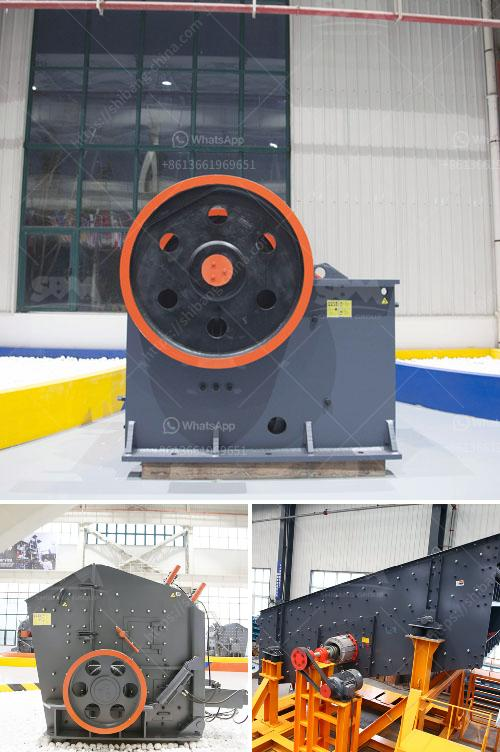

<h3>correct feed of cone crushers</h3>
Cone crushers are used in various industries to break large rocks into smaller, more manageable pieces. These powerful machines have revolutionized the way we process materials, making it easier and more efficient to extract valuable minerals from the earth. However, to ensure optimal performance and prevent unnecessary wear and tear, it is essential to feed cone crushers correctly.

The feed material plays a crucial role in determining how well a cone crusher performs. It affects the crusher's capacity, reduction ratio, and even the shape of the final product. By following a few guidelines, operators can maximize their cone crushers' productivity and prolong their lifespan.

First and foremost, it is crucial to understand the maximum feed size that the cone crusher can handle. Exceeding this limit can result in damage to the machine or even catastrophic failure. Manufacturers provide clear specifications regarding the maximum feed size for each model, and operators must adhere to these guidelines. They can refer to the manual or consult with the manufacturer's technical support team if they have any doubts.

In addition to the maximum feed size, it is equally important to consider the recommended feed range. Cone crushers are designed to operate optimally within a specific range of feed sizes. Feeding material that is too fine or too coarse can lead to suboptimal performance. Fine material may cause packing within the crusher, restricting the flow and reducing the capacity, while coarse material may result in excessive wear on the crushing surfaces. Therefore, it is essential to maintain a consistent feed size that falls within the manufacturer's recommended range.

Furthermore, the feed material should be evenly distributed across the entire width of the crusher's opening. Uneven distribution can cause excessive wear on specific areas of the crushing chamber and result in a shorter lifespan for the machine. To achieve a uniform distribution, operators can use a vibrating grizzly feeder or a well-designed chute system. These methods allow the material to be evenly spread, minimizing the risk of uneven wear patterns.

Another crucial aspect of feeding cone crushers correctly is controlling the feed rate. The feed rate determines the amount of material that enters the crusher per unit of time. It directly impacts the crusher's capacity and the quality of the final product. Running the crusher at a higher feed rate than recommended can lead to overloading and cause unnecessary stress on the machine. Conversely, operating at a lower feed rate may result in underutilizing the crusher's capabilities and reduce overall productivity. Therefore, finding the optimal balance by adjusting the feed rate is essential.

In conclusion, feeding cone crushers correctly is of utmost importance to ensure efficient operation and optimize performance. Operators should adhere to the manufacturer's specifications regarding maximum feed size and recommended feed range. They should also aim to achieve an even distribution of the feed material across the crusher's opening and control the feed rate to strike the right balance. By following these guidelines, operators can achieve maximum productivity while minimizing wear and tear, ultimately prolonging the lifespan of their cone crushers.
<h3>Contact us</h3><ul><li><strong>Whatsapp:&nbsp;<a href="https://wa.me/8613661969651">+8613661969651</a></strong></li><li><a href="https://swt.shibang-china.com/?git&amp;zhl&amp;correct feed of cone crushers"><strong>Online Service(chat now)</strong></a></li></ul><h3>Related</h3><ul><li><a href='business plan for a cement plant.md'>business plan for a cement plant</a></li><li><a href='coconut shell powder making machine grinding mill for sale.md'>coconut shell powder making machine grinding mill for sale</a></li><li><a href='rock grinder crusher suppliers kenya.md'>rock grinder crusher suppliers kenya</a></li><li><a href='mtw series trapezium mill.md'>mtw series trapezium mill</a></li><li><a href='mini cement plant for sale in india.md'>mini cement plant for sale in india</a></li></ul>