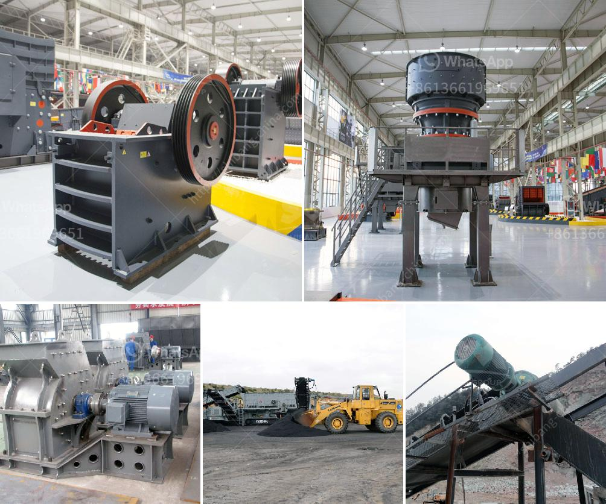

<h3>cost cement plant manufacturers and cost</h3>
Cost is a fundamental factor to consider when investing in a new cement plant. Before making a purchase, the potential investor must be aware of the total cost of establishing the plant. This includes the cost of equipment, raw materials, labor, maintenance, and other expenses that come with running a cement plant.

When it comes to cement plant manufacturers, there are various options available in the market. These manufacturers offer different types of cement plants with varying capacities and features. Each manufacturer has its own pricing structure, making it essential for investors to explore different options and compare costs before making a final decision.

One of the primary factors determining the cost of a cement plant is its capacity. Higher capacity plants require larger infrastructure, more equipment, and increased labor, driving up the overall cost. The location of the plant also plays a role in determining costs as the transportation and availability of raw materials can significantly impact pricing.

The cost of equipment is another crucial aspect to consider when evaluating cement plant manufacturers. The equipment required for a cement plant typically includes crushers, mills, kilns, and various other machinery. This equipment should be of high quality, durable, and efficient to ensure smooth plant operations and maximize productivity.

Raw materials account for a significant portion of the cost in cement production. These materials include limestone, clay, iron ore, and gypsum. The cost and availability of these raw materials can differ from one location to another, influencing the overall cost of the cement plant.

Labor cost is another essential factor as it directly impacts the operational expenses of the plant. Cement plants require skilled workers, including engineers, technicians, and operators. The number of employees required depends on the capacity and complexity of the plant. Higher labor costs can increase the overall cost of the plant and subsequently impact the pricing of the final product.

Maintenance is an ongoing expense that must be considered before investing in a cement plant. Regular maintenance is crucial to prevent breakdowns and ensure the smooth operation of the plant. The cost of maintenance can vary depending on the plant's size, equipment, and complexity.

It is important for potential investors to obtain comprehensive quotations from different cement plant manufacturers to compare costs effectively. The pricing should be transparent and inclusive of all necessary components to avoid any unexpected expenses later on.

Additionally, it is advisable for investors to assess the reputation and track record of the manufacturer in terms of delivering high-quality cement plants. Customer reviews and testimonials can provide valuable insights into the manufacturer's reliability and after-sales service.

In conclusion, determining the cost of cement plant manufacturers involves considering multiple factors such as the plant's capacity, equipment, raw materials, labor, and maintenance. It is essential to explore different options, compare costs, and evaluate reputations before making a final investment decision. By carefully assessing all these aspects, investors can make informed choices and establish a cement plant that is both efficient and cost-effective.
<h3>Contact us</h3><ul><li><strong>Whatsapp:&nbsp;<a href="https://wa.me/8613661969651">+8613661969651</a></strong></li><li><a href="https://swt.shibang-china.com/?git&amp;zhl&amp;cost cement plant manufacturers and cost"><strong>Online Service(chat now)</strong></a></li></ul><h3>Related</h3><ul><li><a href='how much is a stone crusher.md'>how much is a stone crusher</a></li><li><a href='artificial stone production plant in turkey.md'>artificial stone production plant in turkey</a></li><li><a href='stone crusher machine 100 cm.md'>stone crusher machine 100 cm</a></li><li><a href='allis chalmers gyratory crushers.md'>allis chalmers gyratory crushers</a></li><li><a href='crusher impact germany.md'>crusher impact germany</a></li></ul>