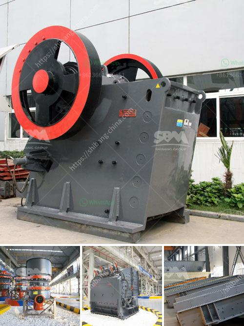

<h3>cost for a bauxite mining company</h3>
Bauxite mining plays a crucial role in the global economy, as bauxite ore is the primary source of aluminum. Efficient management of costs is critical for sustainable and profitable operations for bauxite mining companies. In this article, we will explore the key cost considerations that these companies must take into account.

One of the primary expenses for a bauxite mining company is the initial investment in machinery and infrastructure. Procuring and maintaining heavy machinery, such as excavators and haul trucks, required for extraction and transportation of bauxite ore involves significant capital expenditure. Additionally, investments in supporting infrastructure, including roads, processing plants, and storage facilities, contribute to the overall cost structure.

Bauxite mining is an energy-intensive process, requiring large amounts of electricity. Energy costs, including electricity, fuel, and water, can significantly impact the overall expenses for mining companies. Implementing energy-efficient technologies and renewable energy sources can help companies reduce their operational costs and improve their carbon footprint.

Labor-intensive activities like bauxite mining require a substantial workforce. Labor expenses include wages, benefits, and safety measures to ensure a secure working environment for employees. Skillful labor is necessary for efficient mining and ore processing, making it essential to invest in recruitment, training, and employee retention programs.

Bauxite mining companies must comply with stringent environmental regulations, ensuring sustainable practices and mitigating any adverse impact on the environment. Costs associated with environmental assessments, pollution control measures, land rehabilitation, and reforestation efforts can significantly add to the overall expenditure.

Transporting bauxite ore from mining sites to processing plants or to ports for export involves substantial logistics and transportation costs. Securing appropriate infrastructure, negotiating favorable contracts with transportation providers, and optimizing the transportation routes can help minimize costs while ensuring timely deliveries.

As with any mining operation, bauxite mining companies face numerous cost considerations while striving for sustainable and profitable operations. Balancing investments in equipment, infrastructure, labor, energy, and environmental compliance poses a significant challenge. However, by prioritizing cost-efficient technologies, optimizing energy consumption, and promoting socially responsible mining practices, companies can enhance their competitiveness while minimizing their impact on the environment.
<h3>Contact us</h3><ul><li><strong>Whatsapp:&nbsp;<a href="https://wa.me/8613661969651">+8613661969651</a></strong></li><li><a href="https://swt.shibang-china.com/?git&amp;zhl&amp;cost for a bauxite mining company"><strong>Online Service(chat now)</strong></a></li></ul><h3>Related</h3><ul><li><a href='industrial grinder machine south africa.md'>industrial grinder machine south africa</a></li><li><a href='china stone crusher closed circuit.md'>china stone crusher closed circuit</a></li><li><a href='buy the stone crusher function of 1100.md'>buy the stone crusher function of 1100</a></li><li><a href='high energy ball milling process.md'>high energy ball milling process</a></li><li><a href='trommel screen capacity calculation.md'>trommel screen capacity calculation</a></li></ul>