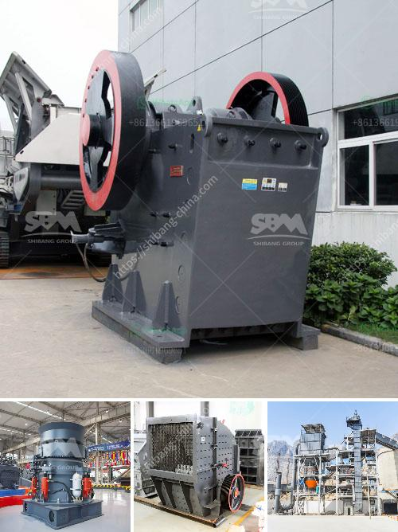

<h3>cost for set up of cement factory</h3>
Setting up a cement factory involves a significant initial investment for land acquisition, construction, and equipment procurement. The cost for the overall setup will vary depending on the location and size of the plant. However, it is estimated that a cement factory will cost around $200-500 per tonne to set up.

Firstly, the cost for land acquisition can be substantial, especially if the factory needs to be located near limestone deposits, which are the primary raw material for cement production. The cost of acquiring and developing the land can range from $5-20 million, depending on various factors such as accessibility, distance from the raw material source, and infrastructure availability.

Secondly, constructing the factory premises and infrastructure is another significant cost. This includes building structures for various production units, administrative offices, warehouses, and other facilities. The cost for constructing a cement factory can range from $50-150 million, depending on the size and complexity of the project.

Thirdly, the cost of procuring and installing the necessary equipment is substantial. This includes the purchase of machinery for crushing, blending, grinding, and packaging the raw materials. The cost of equipment can range from $50-200 million, depending on the production capacity and technology used.

Additionally, there are costs associated with obtaining necessary permits, licenses, and clearances from regulatory authorities, which can vary depending on the region and local regulations.

It is important to mention that setting up a cement factory is a long-term investment, and the returns may take several years to materialize. The financial viability of the project depends on various factors such as market demand, competition, and efficient management of the production process.

In conclusion, the costs for setting up a cement factory can be substantial and are influenced by factors such as land acquisition, construction, equipment procurement, and regulatory requirements. This initial investment lays the foundation for future production and profitability, making it crucial to carefully plan and evaluate the feasibility of such a venture.
<h3>Contact us</h3><ul><li><strong>Whatsapp:&nbsp;<a href="https://wa.me/8613661969651">+8613661969651</a></strong></li><li><a href="https://swt.shibang-china.com/?git&amp;zhl&amp;cost for set up of cement factory"><strong>Online Service(chat now)</strong></a></li></ul><h3>Related</h3><ul><li><a href='mobile roller crushers in south africa.md'>mobile roller crushers in south africa</a></li><li><a href='roller crusher brick making machine.md'>roller crusher brick making machine</a></li><li><a href='pakistan quarry crusher manufacturer.md'>pakistan quarry crusher manufacturer</a></li><li><a href='stone gravel crusher machine used for sale uae.md'>stone gravel crusher machine used for sale uae</a></li><li><a href='clay grinder machine kerala.md'>clay grinder machine kerala</a></li></ul>