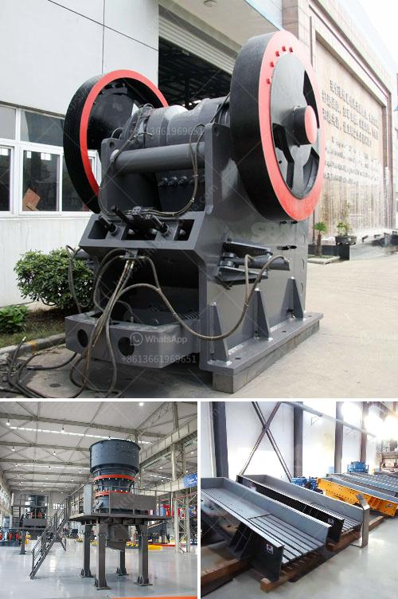

<h3>cost new jaw crusher</h3>
The cost of a new jaw crusher is one of the concerns of customers in the mining and construction industry. The price of the jaw crusher has a great impact on the purchase cost and the subsequent investment of customers. Over the years, the jaw crusher has been favored by the majority of users because of its high reliability, wide application range, and strong crushing capacity.

The new jaw crusher is a new generation of crushing equipment developed by the technical experts of our company on the basis of combining the advantages of the existing jaw crusher technology at home and abroad. It integrates the principles of crushing and its working modes are multiple. The new jaw crusher is designed according to customer needs, giving full play to its advantages.

Firstly, the new jaw crusher has a deep cavity design and a larger crushing ratio. The processing capacity is increased by more than 15% compared with the traditional jaw crusher. This ensures that the materials can be fully broken in the cavity and the crushing efficiency is improved.

Secondly, the new jaw crusher adopts a V-shaped crushing cavity design, which makes the actual feeding width and nominal feeding width consistent. The feeding capacity is stronger, and the discharge port is not easily blocked, which effectively solves the problem of low output due to material blockage.

Thirdly, the new jaw crusher adopts a high-quality bearing, which greatly improves the performance and stability of the equipment, reduces maintenance costs, and extends the service life. At the same time, the new jaw crusher is equipped with a centralized lubrication system, which makes the lubrication of the bearing parts more convenient and effectively reduces the maintenance workload.

Fourthly, the new jaw crusher has a compact structure and a small overall size, which reduces the investment cost for customers in terms of equipment transportation and site construction. It can be directly put into production after arriving at the construction site, which effectively saves time and improves production efficiency.

In terms of price, the cost of a new jaw crusher depends on various factors, such as the model, capacity, and technical parameters. Different manufacturers have different prices for the same type of equipment, so the customer should compare multiple suppliers and choose a reliable manufacturer with good after-sales service and reasonable price.

In conclusion, the cost of a new jaw crusher is a significant investment for customers, but it is also an important factor influencing the production efficiency and economic benefits of the project. The new jaw crusher with its distinctive advantages in crushing capacity, environmental protection, and convenience brings higher profits to customers, laying a solid foundation for sustainable development.
<h3>Contact us</h3><ul><li><strong>Whatsapp:&nbsp;<a href="https://wa.me/8613661969651">+8613661969651</a></strong></li><li><a href="https://swt.shibang-china.com/?git&amp;zhl&amp;cost new jaw crusher"><strong>Online Service(chat now)</strong></a></li></ul><h3>Related</h3><ul><li><a href='stone quarrying machines in dubai.md'>stone quarrying machines in dubai</a></li><li><a href='limestone mining crusher industry in nepal.md'>limestone mining crusher industry in nepal</a></li><li><a href='mini concrete crushers.md'>mini concrete crushers</a></li><li><a href='price a stone crusher in peru.md'>price a stone crusher in peru</a></li><li><a href='mobile gold processing plant in germany.md'>mobile gold processing plant in germany</a></li></ul>