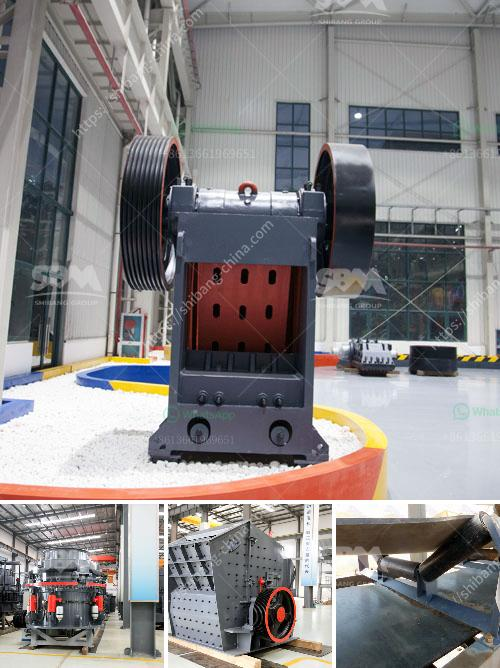

<h3>cost of 150tph cement grinding plant</h3>
The cost of setting up a 150tph cement grinding plant is approximately $150 million. This cost will vary depending on the specific design of the facility and the equipment required. However, in general, the cost of cement grinding plant can be estimated to range from $1,000 to $1,500 per tonne of clinker grinding capacity.

The initial investment includes the cost of land and infrastructure, plant machinery, raw materials, and working capital. The land cost will depend on location and size requirements, and can range between $1.5 million to $5 million. The infrastructure cost includes the construction of buildings, roads, storage facilities, and utilities, which can range from $5 million to $20 million.

The plant machinery cost includes the procurement of grinding mills, separators, and packing equipment. This can vary depending on the technology and automation level chosen. The range for this cost can be between $50 million to $100 million.

Raw material costs include limestone, clay, iron ore, and gypsum. These materials are necessary for the production of cement. The cost can vary depending on availability, transportation, and quality. Typically, this cost can range from $30 million to $50 million.

Finally, working capital is required to cover operational expenses such as salaries, maintenance, and other miscellaneous costs. It is recommended to allocate at least 10% to 15% of the total investment for working capital. For a 150tph cement grinding plant, this can be estimated to be around $10 million to $15 million.

In conclusion, setting up a 150tph cement grinding plant requires a significant investment. The total cost can vary between $150 million to $200 million, depending on various factors. It is crucial to conduct a detailed feasibility study and cost analysis to assess the financial viability of the project. Additionally, it is essential to consider market demand, competition, and regulatory requirements before making such an investment.
<h3>Contact us</h3><ul><li><strong>Whatsapp:&nbsp;<a href="https://wa.me/8613661969651">+8613661969651</a></strong></li><li><a href="https://swt.shibang-china.com/?git&amp;zhl&amp;cost of 150tph cement grinding plant"><strong>Online Service(chat now)</strong></a></li></ul><h3>Related</h3><ul><li><a href='for sale used mobile jaw crusher philippines.md'>for sale used mobile jaw crusher philippines</a></li><li><a href='raymond mill price.md'>raymond mill price</a></li><li><a href='slag processing machine in australia.md'>slag processing machine in australia</a></li><li><a href='calculate output of aggregate crushing plant.md'>calculate output of aggregate crushing plant</a></li><li><a href='quarry dust in concrete sand making stone quarry.md'>quarry dust in concrete sand making stone quarry</a></li></ul>