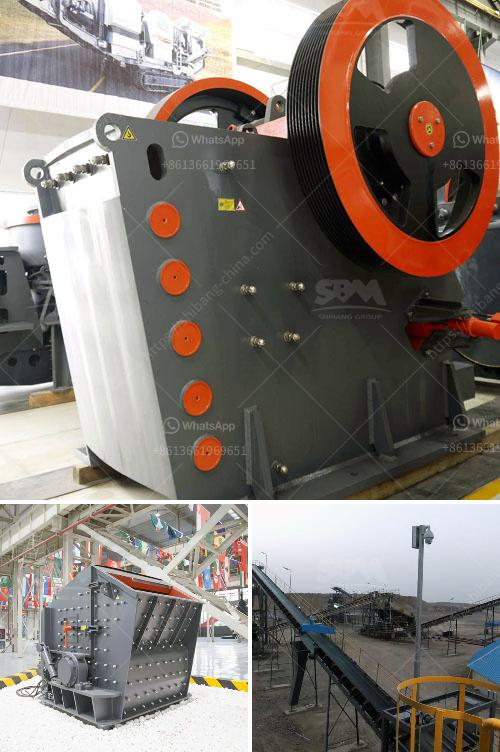

<h3>cost of belt conveyor coal transport</h3>
In today's modern industrial world, coal is a vital resource to power various electrical appliances and machinery. The coal mining industry plays a significant role in supplying coal to power plants and other industries that require it for electricity generation. One critical aspect of the coal mining process is transporting coal from the coal mine to its designated destination, which is where belt conveyor systems come into play.

A belt conveyor system is a highly efficient mode of coal transportation that uses a belt to carry the coal from one location to another. These conveyor belts loop endlessly around pulleys and are typically made of rubber or PVC material. As the belt moves, coal is placed on it and is transported along the length of the belt until it reaches its destination.

When it comes to evaluating the cost of belt conveyor coal transport, several factors come into play. The first factor to consider is the initial cost of investing in a belt conveyor system. The cost of purchasing the conveyor belts, the installation process, and any additional equipment required for efficient operation can be significant. However, once the system is up and running, the long-term cost benefits are immense.

One critical advantage of using belt conveyor coal transport is its low operational cost. Once installed, these systems require minimal human intervention, thus reducing labor costs significantly. As the system runs continuously, it can transport large volumes of coal in a short time, making it incredibly efficient and cost-effective.

Maintenance costs are another crucial aspect to consider when evaluating the total cost of belt conveyor coal transport. Like any machinery, belt conveyor systems require periodic maintenance, such as belt replacement and routine inspections. However, the frequency and cost of maintenance are relatively low, making it a cost-effective mode of coal transportation in the long run.

One of the key cost-saving benefits of belt conveyor systems is their energy efficiency. Unlike other coal transport methods, such as trucks or trains, belt conveyors require less energy to operate. These systems are designed to minimize friction, resulting in less energy consumption during operation. As a result, the cost of energy required for coal transport is significantly reduced, positively impacting the overall operational cost.

Furthermore, belt conveyor coal transport systems minimize the risk of accidents and damage to coal during transportation. The belts are designed to prevent coal spillage, thus ensuring the safe and efficient delivery of coal to its destination. By reducing the risk of accidents and damage, the cost associated with lost coal and potential lawsuits is eliminated, making belt conveyor systems an economically viable option for transporting coal.

In conclusion, while the initial cost of investing in belt conveyor coal transport systems can be substantial, the long-term cost benefits outweigh the initial investment. The low operational and maintenance costs, energy efficiency, and safety advantages make belt conveyor systems a preferred mode of coal transportation. Therefore, considering the ever-increasing demand for coal, especially in the power generation sector, investing in belt conveyor systems appears to be a prudent decision for coal mining companies, ensuring the efficient and cost-effective transportation of coal.
<h3>Contact us</h3><ul><li><strong>Whatsapp:&nbsp;<a href="https://wa.me/8613661969651">+8613661969651</a></strong></li><li><a href="https://swt.shibang-china.com/?git&amp;zhl&amp;cost of belt conveyor coal transport"><strong>Online Service(chat now)</strong></a></li></ul><h3>Related</h3><ul><li><a href='clinker grinding mill machine germany.md'>clinker grinding mill machine germany</a></li><li><a href='aggregate screens for sale.md'>aggregate screens for sale</a></li><li><a href='bentonite powder mill manufacturers.md'>bentonite powder mill manufacturers</a></li><li><a href='crushing machine in quarry.md'>crushing machine in quarry</a></li><li><a href='placer mining wash plant operating costs.md'>placer mining wash plant operating costs</a></li></ul>