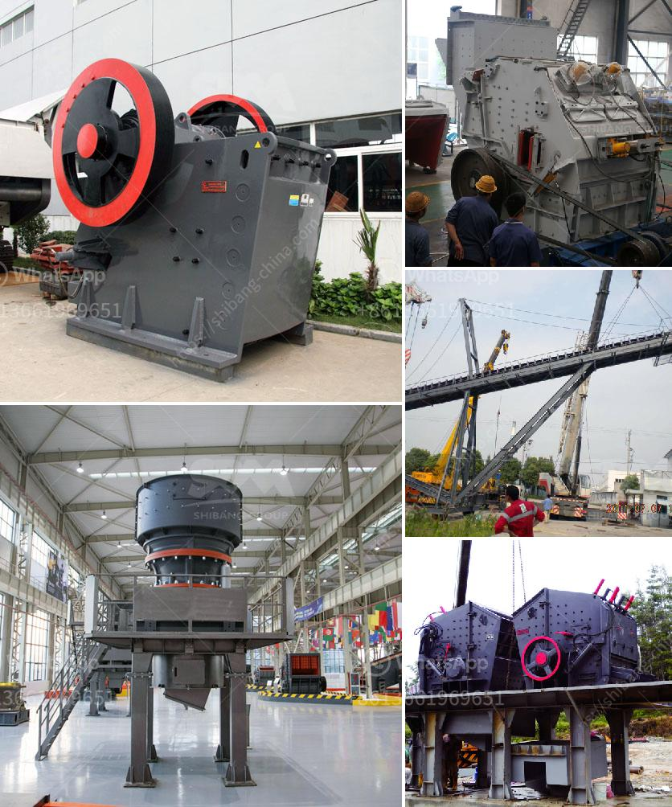

<h3>cost of limestone pulverizer</h3>
Limestone pulverizers, also known as limestone mills or limestone crushers, are used to grind limestone into fine powder for various applications. With the increasing demand for limestone powder in industries such as construction, agriculture, and water treatment, the cost of this pulverizing machine has become an important consideration.

1. Size of the machine: Larger pulverizers are generally more expensive than smaller ones. The size of the pulverizer also determines the amount of limestone that can be processed at a given time.

2. Quality and durability: High-quality pulverizers tend to be more expensive but also offer better performance and longer lifespan. They are designed to withstand heavy-duty usage and provide consistent results over time.

3. Power consumption: The energy consumption of a limestone pulverizer affects not only the operational cost but also the environmental impact. Newer models with advanced technology are often more energy-efficient, allowing for cost savings in the long run.

4. Maintenance and spare parts: Regular maintenance is crucial to ensure the longevity and efficiency of a pulverizer. Purchasing a machine that comes with easily accessible spare parts and a comprehensive after-sales service can help minimize maintenance costs.

5. Brand reputation: Established brands with a solid reputation often provide higher-quality products, reliable customer support, and warranty options. This may come with a higher upfront cost but provides peace of mind and better overall value.

It is important to conduct thorough research and compare prices, features, and customer reviews before making a purchase decision. Additionally, consulting with industry experts or getting quotes from different suppliers can help in determining an accurate cost estimate.

In summary, the cost of a limestone pulverizer can vary depending on factors such as size, quality, power consumption, maintenance, and brand reputation. While it may be tempting to opt for a cheaper option, investing in a reliable and efficient machine can lead to long-term cost savings and improved productivity.
<h3>Contact us</h3><ul><li><strong>Whatsapp:&nbsp;<a href="https://wa.me/8613661969651">+8613661969651</a></strong></li><li><a href="https://swt.shibang-china.com/?git&amp;zhl&amp;cost of limestone pulverizer"><strong>Online Service(chat now)</strong></a></li></ul><h3>Related</h3><ul><li><a href='brick making machine for sale in south africa.md'>brick making machine for sale in south africa</a></li><li><a href='how much does coal mining machines costs.md'>how much does coal mining machines costs</a></li><li><a href='working principle structure of stone crusher.md'>working principle structure of stone crusher</a></li><li><a href='placer mining wash plant operating costs.md'>placer mining wash plant operating costs</a></li><li><a href='crusher price china.md'>crusher price china</a></li></ul>