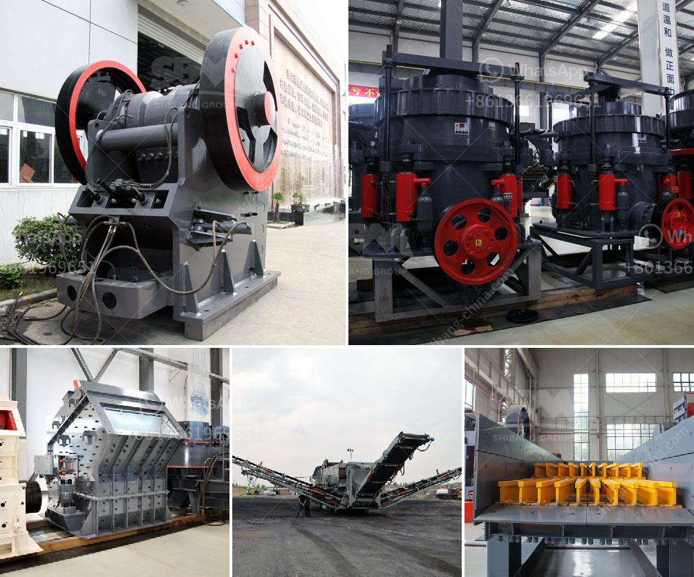

<h3>cost of setting up a cement plant in usa</h3>
The cement industry is an important backbone of the country's infrastructure, playing a pivotal role in the construction of vital structures required for economic growth and development. The cost of setting up a cement plant varies depending on the specific location and available resources. The cost range for an 8000 tons per day (tpd) facility with the latest technology and state-of-the-art equipment is around $250-$300 million.

Governments around the world are becoming increasingly concerned about the environmental impact of cement production. As a result, the latest cement plants are equipped with highly efficient pollution control systems, which ensure that the emissions produced during the manufacturing process are minimal and adhere to national and international environmental standards. These updated environmental regulations may further contribute to the overall cost of setting up a cement plant.

The most significant costs involved in the construction of a cement plant can be categorized into two main sections: land acquisition and equipment procurement.

Land acquisition is an initial cost borne by the project developer. It involves acquiring a suitable plot of land for establishing the cement plant. The cost of land can vary significantly depending on its location, proximity to transportation infrastructure, and availability of necessary utilities. For instance, in urban areas, the cost of land per acre can range between $2-$10 million, while in rural areas, it can be considerably lower.

Equipment procurement is another crucial factor contributing to the cost of setting up a cement plant. The essential machinery required for cement manufacturing includes crushers, raw mills, kilns, clinker grinding, cooler systems, and cement mills. The cost of these equipment can range from $50 to $300 million, depending on the scale of the cement plant and the variety of cement production techniques implemented.

Moreover, the overall cost of setting up a cement plant is affected by several external factors such as local regulations and taxes. These regulations may impact the import of specialized equipment or the availability of skilled labor, ultimately affecting the plant's operating cost. Additionally, the availability and cost of essential raw materials like limestone and gypsum must be considered when setting up a cement plant.

It is worth noting that the capital investment required for setting up a cement plant is a long-term investment that often takes several years to recover. The return on investment in the cement industry heavily relies on demand, market conditions, and efficient production processes. Therefore, it is essential to conduct a thorough feasibility study to assess the economic viability and profitability of establishing a cement plant.

In conclusion, the cost of setting up a cement plant in the USA is significant due to the extensive investment required in land acquisition, equipment procurement, and compliance with environmental regulations. The overall profitability and success of a cement plant depend on various factors, including market demand and the implementation of advanced technology to ensure efficient and sustainable production processes.
<h3>Contact us</h3><ul><li><strong>Whatsapp:&nbsp;<a href="https://wa.me/8613661969651">+8613661969651</a></strong></li><li><a href="https://swt.shibang-china.com/?git&amp;zhl&amp;cost of setting up a cement plant in usa"><strong>Online Service(chat now)</strong></a></li></ul><h3>Related</h3><ul><li><a href='grinding raymond mill.md'>grinding raymond mill</a></li><li><a href='mica processing technology and flow chart.md'>mica processing technology and flow chart</a></li><li><a href='prices of stone crushers in johannesburg.md'>prices of stone crushers in johannesburg</a></li><li><a href='tonne per hour ball mill gold crushing.md'>tonne per hour ball mill gold crushing</a></li><li><a href='sand making plant.md'>sand making plant</a></li></ul>