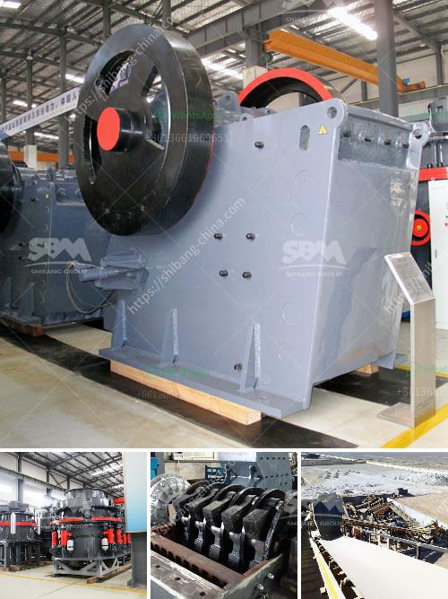

<h3>cost of stone crusher production line in china</h3>
The cost of stone crusher production line in China has always been the hot topic that the customers are concerned about. Quick contact with our staff to get more specifications and price. Just a simple click! So, how much does it cost to set up a stone crushing line?

The growing demand for stone materials in construction projects has resulted in an increase in the crushing industry's production capacity. However, due to the uneven distribution of stone resources, the crusher's production capacity and efficiency will vary according to the hardness and characteristics of the materials being crushed.

To establish a stone crusher production line, it will take millions of capital, such as land, machinery, labor, and other resources. After considering the different factors, customers will choose different configurations of stone crushers to produce the required materials.

What is the actual cost of stone crusher production line? According to different production requirements, stone crusher plant has various configuration with different output capacities. 50-80tph stone crusher plant is one suitable option for limestone and basalt crushing plant. Over years of experience, we can mainly distinguished the different specifications of PE500×750, PE600×900, PE750×1060, PE900×1200, etc.

The price difference of crushers with the same specifications ranges from tens of thousands to hundreds of thousands, so users have to decide on their own budgets, and consult manufacturers for specific prices. The customers who choose Zhengzhou Vanguard Machinery Technology Co., Ltd. have guaranteed equipment quality, good output, solid power, and energy efficiency. In addition, we will provide sufficient after-sales service, so that your production line can keep up with the pace of the construction period, and create revenue more quickly.

Customers can choose the appropriate model of crusher according to their actual needs. If the formation of raw materials is in large blocks or with high hardness, cone crusher or impact crusher can be used as the secondary crushing equipment, after primary crushing with jaw crusher.

Different specifications of stone raw materials can be processed into different sizes of crushed stones by a crusher. The final products shape can be square or grain shapes, and users can choose different types of crushers according to their stone hardness, pulverization degree, and finished product requirements.

Stone crusher production line is made of broken down chunks of rock or gravel. Stone crushing production line processes various kinds of stones into required size particles. It is the main equipment for producing sand or gravel used in road and bridge construction, urban construction, etc.

There are many types of stone crushers, including jaw crusher, impact crusher, hammer crusher, cone crusher, mobile crusher, roll crusher, vertical shaft impact crusher, compound crusher, single stage crusher, and tertiary impact crusher, at the same time, there are also some professional crushers, such as marble crusher, granite crusher, limestone crusher, river pebble crusher, etc.

According to different process requirements, various types of equipment are combined to meet the different process requirements of customers.

In recent years, as natural sand and gravel resources have been depleted, sandstone aggregate is being increasingly valued. The recycled aggregate produced by our crushing production line can be used to produce environmentally friendly bricks and other building materials, effectively reducing the accumulation of construction waste and reducing environmental pressures.

To sum up, choosing a granite crusher production line can not only be based on the output desired, but also consider the varying degrees of hardness of the crushed materials, and the required stone size. GZD1500×6000 vibrating feeder, PE-1200×1500 jaw crusher, GP cone crusher2 sets, HP300 cone crusher, PF-1820 impact crusher, 3YK3072vibrating screen, conveyor belt, etc.

If you need to know more details about the crushing production line calculation, please kindly reach out to our professional team. We can provide customers from all over the world with standardized and high-quality cost on stone crushing plant items at competitive prices. Additionally, we have a group of professional technical engineers and after-sales service staff, which helps us to offer faster and more comprehensive guidance and solutions to the client, making a positive contribution to the development of the industry.
<h3>Contact us</h3><ul><li><strong>Whatsapp:&nbsp;<a href="https://wa.me/8613661969651">+8613661969651</a></strong></li><li><a href="https://swt.shibang-china.com/?git&amp;zhl&amp;cost of stone crusher production line in china"><strong>Online Service(chat now)</strong></a></li></ul><h3>Related</h3><ul><li><a href='quartz production process.md'>quartz production process</a></li><li><a href='ball mill battery lead pdf.md'>ball mill battery lead pdf</a></li><li><a href='crusher plant in rows.md'>crusher plant in rows</a></li><li><a href='bentonite powder mill manufacturers.md'>bentonite powder mill manufacturers</a></li><li><a href='small scale gold mill from china.md'>small scale gold mill from china</a></li></ul>