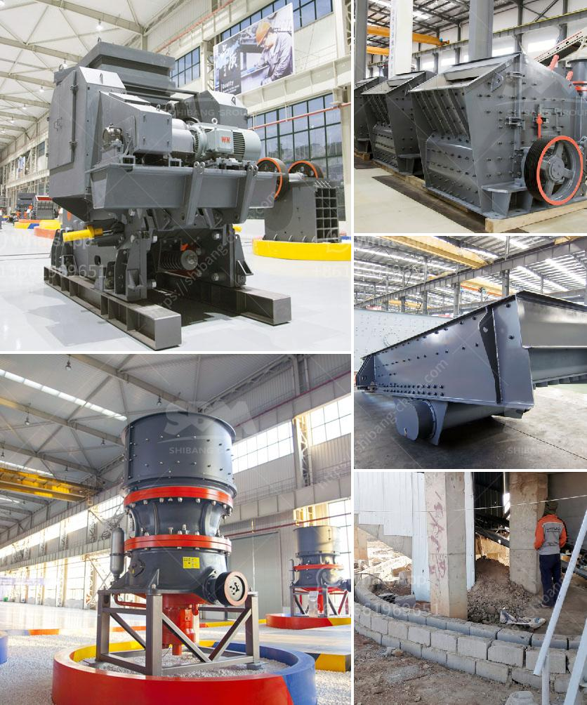

<h3>cost of the plant capacity of crusher</h3>
The cost of plant capacity of a crusher is an important factor to consider when purchasing the equipment. Crushers are used to reduce the size of various materials, such as rocks, ore, and concrete, and they are crucial in a variety of industries including mining, construction, and recycling.

The plant capacity refers to the maximum amount of material that the crusher can handle within a specified time period. It is typically measured in tons per hour. The higher the plant capacity, the more efficient and productive the crusher will be.

The cost of the plant capacity of a crusher can vary based on several factors. Firstly, it depends on the type of crusher being used. There are different types of crushers available with varying capacities, such as jaw crushers, impact crushers, cone crushers, and gyratory crushers. Each type has its own cost associated with it, with some being more expensive than others.

Another factor that can affect the cost of the plant capacity is the brand and model of the crusher. Well-known and reputable brands usually come with a higher price tag, but they often offer better quality and durability. The model of the crusher can also impact the cost, as more advanced models with additional features may be more expensive.

Additionally, the cost of the plant capacity can also be influenced by the location and supplier. Different regions or countries may have varying rates for crushers and their components. It is also important to consider the supplier's reputation and track record, as well as any additional services they may offer, such as installation and maintenance.

When considering the cost of the plant capacity of a crusher, it is crucial to find a balance between the budget and the desired capacity. It is essential to invest in a crusher that can handle the required amount of material efficiently to avoid any production delays or bottlenecks. It is also essential to consider the long-term benefits and potential return on investment that a higher capacity crusher can provide.

In conclusion, the cost of the plant capacity of a crusher depends on various factors, including the type, brand, model, location, and supplier. It is essential to carefully assess the requirements and budget before making a purchase decision. Investing in a high-capacity crusher can improve productivity and efficiency in various industries, making it a worthwhile investment in the long run.
<h3>Contact us</h3><ul><li><strong>Whatsapp:&nbsp;<a href="https://wa.me/8613661969651">+8613661969651</a></strong></li><li><a href="https://swt.shibang-china.com/?git&amp;zhl&amp;cost of the plant capacity of crusher"><strong>Online Service(chat now)</strong></a></li></ul><h3>Related</h3><ul><li><a href='operation and maintenance manuals of cone crusher.md'>operation and maintenance manuals of cone crusher</a></li><li><a href='model of raymound roller mill.md'>model of raymound roller mill</a></li><li><a href='manufacturer of jaw crusher.md'>manufacturer of jaw crusher</a></li><li><a href='pe jaw crusher stone jaw crusher for rock crushing.md'>pe jaw crusher stone jaw crusher for rock crushing</a></li><li><a href='250tph grinding equipment price.md'>250tph grinding equipment price</a></li></ul>