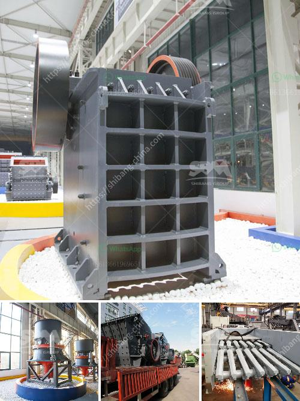

<h3>cost of used crusher for granite</h3>
Granite is an igneous rock formed by the cooling and solidification of magma beneath the Earth's surface, which makes it a very durable and strong material. Used crushers are used in various industries, mainly for granite crushing purposes. The cost of used granite crusher varies based on the model and features of the crusher, as well as the region it is to be sold in.

One of the popular options for used crushers is the jaw crusher, which is known for its ability to crush hard and abrasive materials effectively. Jaw crushers generally have a high crushing ratio and can handle larger feed sizes compared to impact crushers, making them a preferred choice for primary crushing. Prices for used jaw crushers can range from several thousand dollars to tens of thousands of dollars, depending on the model, condition, and age of the crusher.

Another commonly used crusher for granite is the cone crusher. Cone crushers are versatile machines that are well-suited for secondary or tertiary crushing applications. They are particularly useful for producing fine and even-sized aggregates. Prices for used cone crushers can vary greatly depending on factors such as the production capacity, wear parts condition, and the level of automation or control.

When considering the cost of a used granite crusher, it is essential to evaluate its condition. The condition of the crusher directly affects its performance and lifespan. A crusher in good condition will usually come at a higher cost but can provide more value in terms of efficiency and reliability over time. On the other hand, a lower-priced crusher might require more maintenance and repairs, which can eventually add up to additional costs.

Location also plays a significant role in determining the cost of a used granite crusher. The price of the crusher can vary based on geographical factors such as the local demand and supply, transportation costs, and local taxes or regulations. In some regions, the availability of used crushers may be limited, which can drive up their prices. Therefore, it is essential to consider factors such as proximity to the market and availability of spare parts when assessing the cost of a used granite crusher.

Aside from the initial purchase cost, there are other expenses to consider when investing in a used granite crusher. These can include costs related to transportation, installation, and setup. Additionally, ongoing maintenance and repairs should be factored into the overall cost. Regular servicing and replacing wear parts, such as jaw plates or mantle liners, will contribute to the operational efficiency and longevity of the crusher.

In conclusion, the cost of a used granite crusher can vary significantly based on several factors, including the type of crusher, its condition, and the region it is being sold in. It is crucial to evaluate the performance, lifespan, and ongoing maintenance requirements of the crusher when considering its cost. By weighing the expenses against the expected benefits and conducting thorough research, one can make an informed decision and find a suitable used granite crusher that meets their requirements and budget.
<h3>Contact us</h3><ul><li><strong>Whatsapp:&nbsp;<a href="https://wa.me/8613661969651">+8613661969651</a></strong></li><li><a href="https://swt.shibang-china.com/?git&amp;zhl&amp;cost of used crusher for granite"><strong>Online Service(chat now)</strong></a></li></ul><h3>Related</h3><ul><li><a href='small scale gold cip processing.md'>small scale gold cip processing</a></li><li><a href='hydraulic driven track mobile plant.md'>hydraulic driven track mobile plant</a></li><li><a href='industrial mill crusher price.md'>industrial mill crusher price</a></li><li><a href='industrial rotary dryers for sale india.md'>industrial rotary dryers for sale india</a></li><li><a href='crushing and mining equipment companies in uae.md'>crushing and mining equipment companies in uae</a></li></ul>