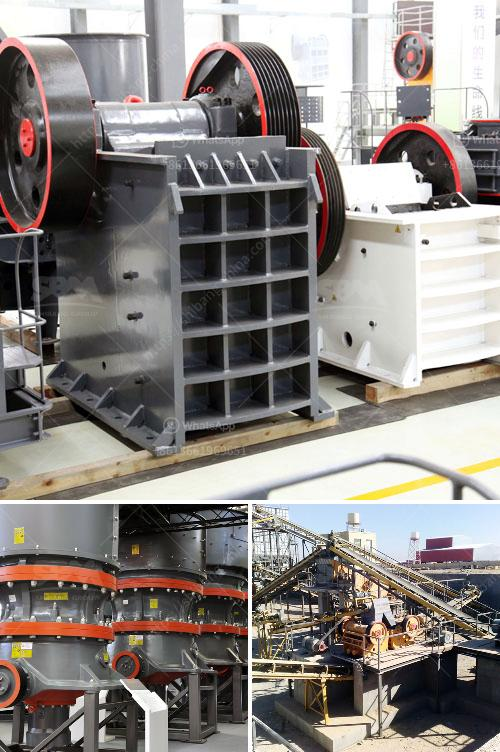

<h3>crusehr equipment ball mill</h3>
Ball mill is an efficient tool for grinding many materials into fine powder. The ball mill is used to grind many kinds of mine and other materials, or to select the mine. It is widely used in building material, chemical industry, etc. There are two ways of grinding: the dry process and the wet process. It can be divided into tabular type and flowing type according to different forms of discharging material.

Ball mill is widely used in cement, silicate products, new building materials, refractories, fertilizers, black and non-ferrous metal beneficiation, and glass ceramics industries. It grinds various ores and other grindable materials dry or wet. China Ball Mill Machine is the key equipment for recrushing the materials after they are primarily crushed. It is widely used for the dry type or wet type grinding of all kinds of ores and other grindable materials in cement, silicate product, new building material, refractory, fertilizer, black and non-ferrous metals and glass ceramic industry. The ore grinding methods of ball mill include dry type and wet type. Ball mill machine is mainly composed of feeding part, discharging part, rotary part and driving part which includes reducer, small drive gear, electrical machine and electronic control.

1. The machine is made up of feeding part, discharging part, gyre part, transmission part (reducer, small transmission gear, motor, and electrical controller) and so on.

2. The hollow axis adopts the cast steel, and the lining can be replaced. The big rotary gear is forged from cast rolling gears.

Ball mill machine is mainly applied to grind the crushed materials that are widely used in various industries such as cement, silicate products, new building materials, refractory materials, fertilizer, black and non-ferrous metal processing and glass ceramics.

Although the ball mill machine is suitable for grinding all kinds of ores and other materials, good lubrication plays an important role in ensuring its smooth operation. The ball mill machine should be regularly lubricated with lubricating oil to maintain its good lubrication state, ensure the normal operation of the equipment and extend its service life.

Ball mill, as an indispensable grinding equipment in mineral processing, plays a critical role in various beneficiation processes. The current ball mill has the characteristics of reliable operation, reasonable design, and convenient maintenance. The application of ball mill in cement industry is indispensable, as the contributions made by ball mills can save energy and reduce consumption. Ball mills have been used in various industries for over a century, and the grinding process is still the most commonly used method in various industries. However, with the development of new materials, the improvement of process technology, and the upgrade of equipment, ball mills will continue to evolve and adapt to the changing needs of the market.
<h3>Contact us</h3><ul><li><strong>Whatsapp:&nbsp;<a href="https://wa.me/8613661969651">+8613661969651</a></strong></li><li><a href="https://swt.shibang-china.com/?git&amp;zhl&amp;crusehr equipment ball mill"><strong>Online Service(chat now)</strong></a></li></ul><h3>Related</h3><ul><li><a href='gypsum mining crusher dubai.md'>gypsum mining crusher dubai</a></li><li><a href='cement plant business plan.md'>cement plant business plan</a></li><li><a href='second hand quarry equipment price philippines.md'>second hand quarry equipment price philippines</a></li><li><a href='conveyor belts in horizontal position.md'>conveyor belts in horizontal position</a></li><li><a href='how to start mining business in india.md'>how to start mining business in india</a></li></ul>