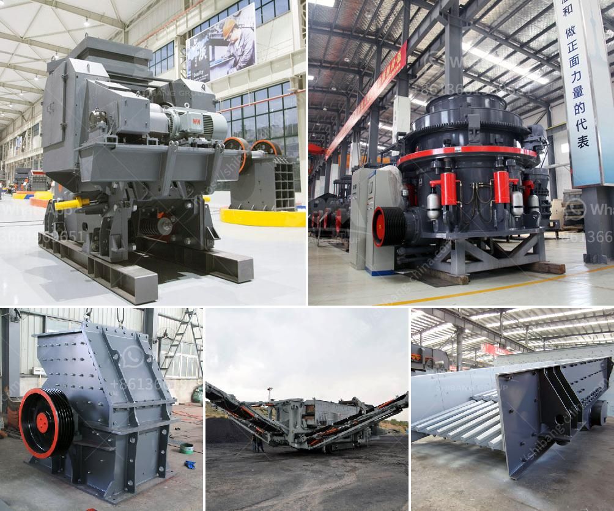

<h3>crush basalt machine</h3>
Crushing basalt rocks to produce construction materials has become a vital process in many industries. Basalt is a common igneous rock formed from the rapid cooling of lava flows. Its strength and durability make it an excellent material for a wide range of applications, including road construction, concrete production, and railway ballast.

To crush basalt efficiently and effectively, specialized machinery is required. One such machine is the crush basalt machine. This powerful equipment is designed to break down large rocks into smaller, more manageable sizes. It utilizes advanced technology to ensure high productivity and consistent outputs.

The crush basalt machine typically consists of a feed hopper, a jaw crusher or impact crusher, a vibrating screen, and a conveyor belt. The bulk material is fed into the hopper, where it is gradually transferred to the crusher for processing. The jaw crusher or impact crusher applies pressure or impact force to break the rocks into smaller pieces. The vibrating screen separates the crushed materials according to their size, while the conveyor belt transports the final products to designated storage areas.

The crush basalt machine offers several advantages in the crushing process. Firstly, it reduces the labor required to break the rocks manually. With automation and high-speed operations, the machine can process a large volume of basalt rocks in a short period. This not only increases productivity but also ensures efficient use of resources.

Secondly, the crush basalt machine produces consistent and uniform-sized materials. This is crucial for industries such as concrete production that require specific aggregate sizes to achieve desired concrete characteristics. By using this machine, construction companies can maintain quality control and produce high-quality products.

Lastly, the crush basalt machine is designed to withstand the harsh conditions of rugged environments. Its robust construction and durable components ensure reliable performance even in demanding applications. This increases the longevity of the machine and reduces maintenance costs over time.

In conclusion, the crush basalt machine is a crucial piece of equipment for crushing basalt rocks. Its efficient and reliable operation, coupled with its ability to produce consistent and quality materials, makes it a valuable asset in various industries. Investing in this machine can enhance productivity, reduce labor costs, and ultimately contribute to the success of construction projects.
<h3>Contact us</h3><ul><li><strong>Whatsapp:&nbsp;<a href="https://wa.me/8613661969651">+8613661969651</a></strong></li><li><a href="https://swt.shibang-china.com/?git&amp;zhl&amp;crush basalt machine"><strong>Online Service(chat now)</strong></a></li></ul><h3>Related</h3><ul><li><a href='manufacturer of jaw crusher.md'>manufacturer of jaw crusher</a></li><li><a href='suppliers of crusher equipment in south africa.md'>suppliers of crusher equipment in south africa</a></li><li><a href='propel stone crusher.md'>propel stone crusher</a></li><li><a href='manufacturers and supplyers of quarry equipment.md'>manufacturers and supplyers of quarry equipment</a></li><li><a href='stone crusher price in india.md'>stone crusher price in india</a></li></ul>