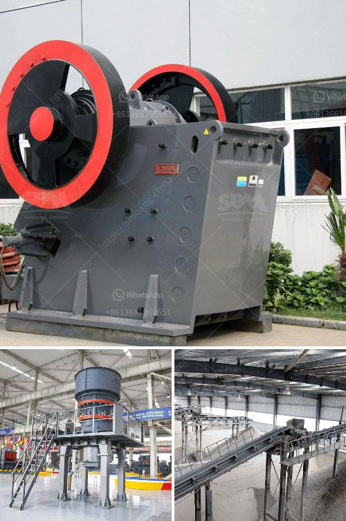

<h3>crush calcite equipment</h3>
Calcite is a widely distributed mineral resource, which is an essential raw material for many industries. The demand for calcite has been increasing steadily due to its excellent properties and versatile applications. As the demand for calcite rises, the need for efficient equipment to crush calcite has become crucial in mining and processing operations.

Calcite is a calcium carbonate mineral with the chemical formula CaCO3. It has a Mohs hardness of 3, meaning it is relatively soft and easy to crush. However, to obtain high-quality calcite products, it is important to ensure proper processing and crushing techniques. The use of advanced crushing equipment can significantly improve the efficiency of calcite processing.

One of the most commonly used crushing equipment for calcite is jaw crusher. Jaw crusher has unique features, such as high crushing ratio, even product size, simple structure, reliable operation, and easy maintenance. It is widely used in various crushing applications, including primary crushing, secondary crushing, and fine crushing of materials.

In the crushing process, jaw crusher applies compressive force to break down the calcite into smaller particles. The crushing chamber is usually designed with a "V"-shaped structure to facilitate the feeding and crushing of calcite. The movable jaw exerts force against the fixed jaw, crushing the calcite between them. The crushed calcite particles are then discharged through the discharge opening at the bottom of the crusher.

In addition to jaw crusher, other equipment can be used to crush calcite efficiently. For example, impact crusher and cone crusher are often used for secondary crushing of calcite. Impact crusher applies the principle of impact crushing to crush calcite, while cone crusher uses the principle of laminated crushing. Both types of equipment are capable of producing high-quality calcite products with excellent particle shape and size distribution.

When selecting crushing equipment for calcite processing, it is important to consider factors such as the desired product size, production capacity, energy consumption, and maintenance requirements. It is advisable to consult with experienced engineers or manufacturers to make an informed decision.

With the advancement of technology, crushing equipment for calcite processing has also evolved. Nowadays, there are various advanced crushing equipment available, such as hydraulic cone crusher, vertical impact crusher, and mobile crushing plants. These equipment offer higher efficiency, greater mobility, and more convenient operation, making them ideal for calcite processing in different environments.

In conclusion, efficient crushing equipment plays a crucial role in the processing of calcite. With the right equipment, it is possible to obtain high-quality calcite products that meet the demands of various industries. Jaw crusher, impact crusher, cone crusher, and other advanced crushing equipment offer efficient solutions for crushing calcite. Choosing the appropriate equipment ensures increased productivity, reduced energy consumption, and improved overall operation in calcite processing operations.
<h3>Contact us</h3><ul><li><strong>Whatsapp:&nbsp;<a href="https://wa.me/8613661969651">+8613661969651</a></strong></li><li><a href="https://swt.shibang-china.com/?git&amp;zhl&amp;crush calcite equipment"><strong>Online Service(chat now)</strong></a></li></ul><h3>Related</h3><ul><li><a href='concrete crusher for sale.md'>concrete crusher for sale</a></li><li><a href='ball milling price.md'>ball milling price</a></li><li><a href='product of 100 tons mini cement plant.md'>product of 100 tons mini cement plant</a></li><li><a href='crusher plant in peshawar.md'>crusher plant in peshawar</a></li><li><a href='cocoa processing plant in nigeria.md'>cocoa processing plant in nigeria</a></li></ul>