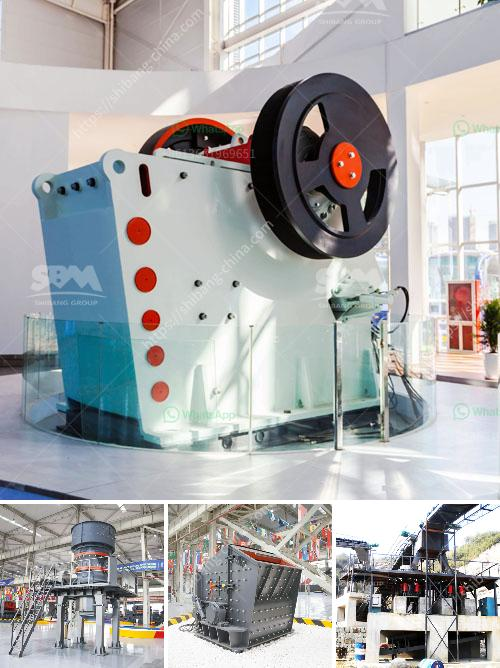

<h3>crushed aggregates supplier in negros</h3>
Negros, the fourth-largest island in the Philippines, is known for its bustling urban cities, picturesque landscapes, and vibrant tourism industry. As development continues to flourish in the region, the demand for construction materials, particularly crushed aggregates, remains high.

A primary supplier of crushed aggregates in Negros is crucial to support the ever-growing infrastructure projects in the area. These essential construction materials play a vital role in various construction applications, including roads, buildings, and bridges. Thus, finding a reliable supplier is paramount to ensure the durability, quality, and safety of these constructions.

One prominent supplier of crushed aggregates in Negros is committed to providing materials that meet the industry's stringent standards. With a vast repository of high-quality aggregates, they cater to the diverse needs and requirements of different construction projects. From small-scale residential undertakings to large-scale infrastructure ventures, they have the capacity to deliver aggregate materials in large quantities promptly.

The crushed aggregates supplied by these industry leaders are sourced from selected hard rock quarries. Through a rigorous extraction process, these rocks are crushed, sized, and classified to produce aggregates of exceptional quality. The aggregates are tested meticulously to ensure conformity to the specifications and standards set by the local governing bodies. This quality assurance guarantees that the materials supplied are durable, reliable, and suitable for construction purposes.

Furthermore, the crushed aggregates supplier in Negros operates with a firm commitment to sustainability and environmental responsibility. They employ efficient and eco-friendly methods in the extraction and production process, minimizing their ecological footprint. These responsible practices ensure the preservation of the natural environment while meeting the growing demand for construction materials.

Apart from providing high-quality aggregates, these suppliers also prioritize excellent customer service. They understand the importance of timely and reliable deliveries in the construction industry. With a modern fleet of delivery trucks, they ensure efficient transportation of the aggregates to construction sites in Negros and surrounding areas. This commitment to professional service and reliability has earned them the trust and loyalty of numerous contractors and developers in the region.

Working with a trusted crushed aggregates supplier in Negros brings numerous advantages. Firstly, it offers convenience, as contractors can source their materials from a single supplier, simplifying the procurement process. Moreover, consistent and high-quality aggregates contribute to the structural integrity and longevity of construction projects, reducing maintenance costs in the long run. Lastly, a reliable supplier helps contractors meet project deadlines by delivering aggregates promptly and consistently.

In conclusion, the presence of a reputable crushed aggregates supplier in Negros is essential to sustain the region's growing construction industry. With their commitment to quality, sustainability, and excellent customer service, these suppliers play a significant role in providing the materials necessary for infrastructure development. By choosing a trusted supplier, contractors and developers in Negros can ensure the durability, efficiency, and safety of their construction projects, contributing to the overall growth and progress of the region.
<h3>Contact us</h3><ul><li><strong>Whatsapp:&nbsp;<a href="https://wa.me/8613661969651">+8613661969651</a></strong></li><li><a href="https://swt.shibang-china.com/?git&amp;zhl&amp;crushed aggregates supplier in negros"><strong>Online Service(chat now)</strong></a></li></ul><h3>Related</h3><ul><li><a href='250tph grinding equipment price.md'>250tph grinding equipment price</a></li><li><a href='crusher price peru stone.md'>crusher price peru stone</a></li><li><a href='company that work in crushing stones.md'>company that work in crushing stones</a></li><li><a href='conveyor belts in south africa.md'>conveyor belts in south africa</a></li><li><a href='land requirement for mini cement plant.md'>land requirement for mini cement plant</a></li></ul>