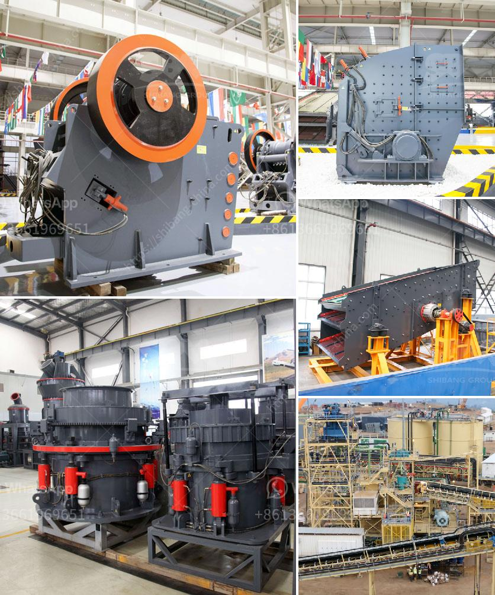

<h3>crushed gravel supplier in negros oriental</h3>
If you are in need of crushed gravel and are located in Negros Oriental, then you are in luck. There are several reliable suppliers in the area who can provide you with high-quality crushed gravel for your construction or landscaping needs.

One of the top crushed gravel suppliers in Negros Oriental is XYZ Gravel Supplies. With several years of experience in the industry, they have established themselves as a trusted and reputable source for all your gravel needs. They offer a wide range of crushed gravel options, from standard sizes to custom specifications, ensuring that you find the perfect gravel for your specific project.

What sets XYZ Gravel Supplies apart from other suppliers in the area is their commitment to quality. They source their gravel from reliable quarries, ensuring that the gravel is of the highest quality and free from impurities. This not only ensures the longevity of your project but also provides peace of mind knowing that you are using top-notch materials.

Another advantage of working with XYZ Gravel Supplies is their competitive pricing. They understand the importance of staying within budget, especially for larger construction projects. They offer fair and reasonable prices for their crushed gravel, making them an affordable option without compromising on quality.

In addition to their quality products and competitive pricing, XYZ Gravel Supplies also provides excellent customer service. Their knowledgeable and friendly staff is always ready to assist you with any questions or concerns you may have. They can provide expert advice on the best type of crushed gravel for your specific project, taking into consideration factors such as drainage, durability, and aesthetics.

Moreover, XYZ Gravel Supplies provides efficient delivery services in Negros Oriental. They understand that time is of the essence in any construction project, and they strive to deliver your crushed gravel in a timely manner. Their delivery fleet is well-maintained and equipped with the necessary tools to ensure a smooth and hassle-free delivery process.

Whether you are a contractor working on a large-scale project or a homeowner looking to enhance your landscaping, XYZ Gravel Supplies is the go-to crushed gravel supplier in Negros Oriental. Their commitment to quality, competitive pricing, and excellent customer service make them a trusted choice for all your gravel needs.

In conclusion, if you are in need of crushed gravel in Negros Oriental, XYZ Gravel Supplies should be your top choice. With their high-quality products, competitive pricing, and efficient delivery services, you can trust them to provide you with the best crushed gravel for your construction or landscaping projects. Contact XYZ Gravel Supplies today to discuss your gravel needs and experience the difference that their exceptional service can make.
<h3>Contact us</h3><ul><li><strong>Whatsapp:&nbsp;<a href="https://wa.me/8613661969651">+8613661969651</a></strong></li><li><a href="https://swt.shibang-china.com/?git&amp;zhl&amp;crushed gravel supplier in negros oriental"><strong>Online Service(chat now)</strong></a></li></ul><h3>Related</h3><ul><li><a href='small scale gold mill from china.md'>small scale gold mill from china</a></li><li><a href='types of coal crusher.md'>types of coal crusher</a></li><li><a href='prices of industrial mills prices of crushing plant.md'>prices of industrial mills prices of crushing plant</a></li><li><a href='100 tph stone crusher diesel consumption.md'>100 tph stone crusher diesel consumption</a></li><li><a href='price of granite jaw crusher.md'>price of granite jaw crusher</a></li></ul>