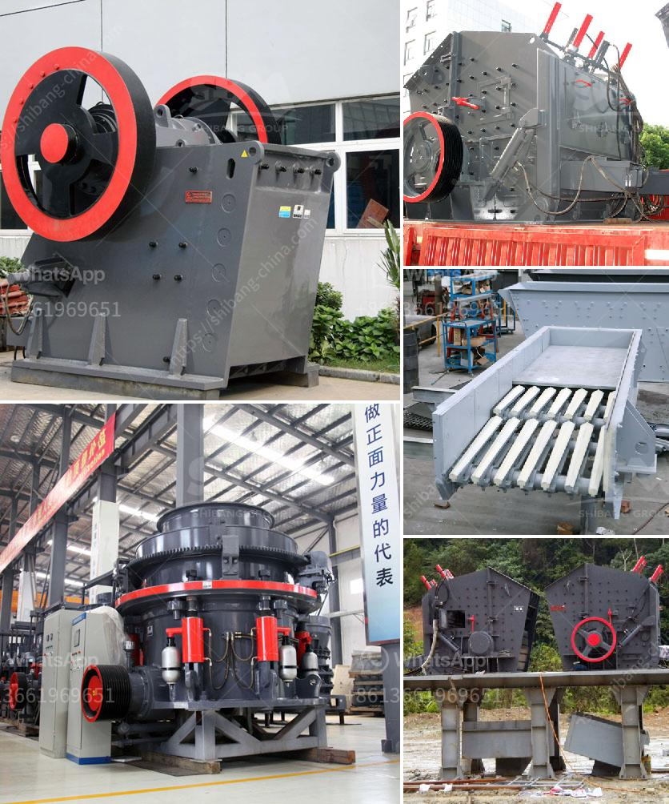

<h3>crushed limestone for sale</h3>
When it comes to construction materials, limestone is widely regarded as one of the most versatile choices available. Not only does it offer exceptional strength and durability, but it also boasts a wide range of applications, making it a staple in both residential and commercial construction projects. Whether you’re planning to construct a driveway, build a foundation, or landscape your outdoor space, crushed limestone is a go-to material that will exceed your expectations.

Crushed limestone is a rock composed of calcium carbonate (CaCO3). It is made by taking large pieces of quarried limestone and crushing them into smaller sizes. The resulting product is a coarse, granular material perfect for base layers, backfilling, drainage applications, and landscaping. Due to its highly versatile nature, crushed limestone finds its use in a variety of construction projects.

One of the most common applications for crushed limestone is in the creation of road base material. When properly compacted, limestone creates a solid surface that provides excellent traction and withstands heavy loads. It is praised for its ability to resist shifting and settling, making it ideal for roads, driveways, and parking lots. Additionally, the natural color tones of limestone give these surfaces an aesthetically pleasing appearance.

Furthermore, the high permeability of crushed limestone makes it a preferred choice for drainage projects. Its open structure allows water to flow through easily, preventing water buildup and minimizing flooding. This makes it an excellent option for French drains, septic system installations, and landscaping projects where proper water drainage is crucial.

Limestone is also widely used in the construction of building foundations and backfill material. Crushed limestone provides a sturdy and stable foundation for buildings, ensuring the structure's long-term integrity. It is often compacted and graded to match the specific requirements of the project. Additionally, crushed limestone can be used as a backfill material behind retaining walls to provide stability and prevent soil erosion.

In landscaping applications, crushed limestone is a versatile material that can be used in gardens, pathways, and as a base for retaining walls or pavers. Its natural light color and texture add a visually appealing element to outdoor spaces, making it a popular choice among homeowners and landscape designers alike.

If you're seeking to purchase crushed limestone for your construction project, it is essential to choose a reputable supplier. Look for a company that offers high-quality products, competitive prices, and convenient delivery options. A reliable supplier will be able to provide you with the appropriate size and quantity of crushed limestone, fulfilling the specific needs of your project. Quality products will not only ensure the success of your construction endeavors but also contribute to the overall durability and longevity of your project.

In summary, crushed limestone is a highly versatile construction material that offers exceptional strength, durability, and a wide range of applications. From road base materials and drainage projects to building foundations and landscaping, crushed limestone is a go-to choice for various construction needs. When seeking to purchase crushed limestone, it is crucial to opt for a reputable supplier that provides high-quality products to ensure the success of your project. With its many advantages, crushed limestone is an invaluable material that can bring your construction projects to life.
<h3>Contact us</h3><ul><li><strong>Whatsapp:&nbsp;<a href="https://wa.me/8613661969651">+8613661969651</a></strong></li><li><a href="https://swt.shibang-china.com/?git&amp;zhl&amp;crushed limestone for sale"><strong>Online Service(chat now)</strong></a></li></ul><h3>Related</h3><ul><li><a href='jaw crushers manufacturers europe.md'>jaw crushers manufacturers europe</a></li><li><a href='grinding mill for sale servants.md'>grinding mill for sale servants</a></li><li><a href='small gravel crushers.md'>small gravel crushers</a></li><li><a href='price of smallest ballast crusher in kenya.md'>price of smallest ballast crusher in kenya</a></li><li><a href='piedra maquinaria agregada equipos de bolivia.md'>piedra maquinaria agregada equipos de bolivia</a></li></ul>