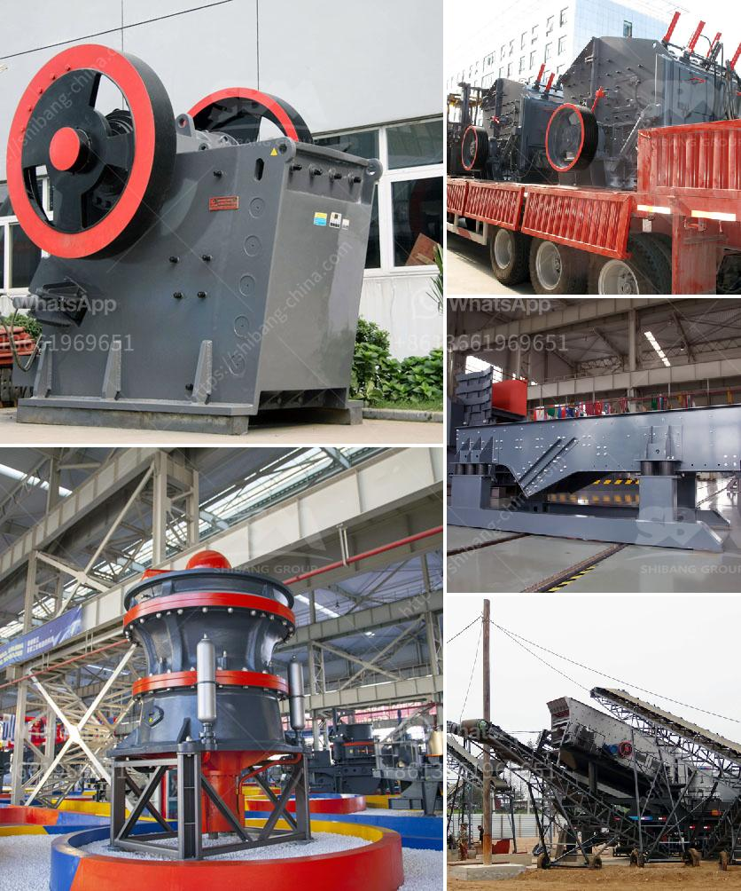

<h3>crusher 50 ton per hour price</h3>
The crushing capacity of a crusher determines the overall operating efficiency of any given unit. Today, we are proud to present to you the crusher 50 ton per hour price. This industry game-changer offers immense power and exceptional efficiency at an affordable price point.

With a crushing capacity of 50 tons per hour, this crusher is ideal for crushing all types of stones, rocks, ores, minerals, and other abrasive materials. Whether you need to crush large-sized pieces or consistently produce smaller aggregates for construction projects, this crusher has got you covered.

What sets the crusher 50 ton per hour price apart from other crushers on the market is its impressive performance capabilities. This robust machine can handle the toughest materials without compromising its efficiency. Its advanced technology allows for a smooth and continuous crushing process, minimizing downtime and maximizing productivity.

Additionally, the crusher 50 ton per hour price features a compact design that is suitable for any job site. Its portability makes it easy to transport and set up, saving both time and money on logistics. The user-friendly interface and intuitive controls ensure effortless operation, making it an ideal choice for any skill level.

Another great advantage of the crusher 50 ton per hour price is its low fuel consumption. This crusher is designed to run efficiently while using minimal energy resources, reducing your operational costs and helping you stay environmentally conscious.

Considering the exceptional performance and affordability that the crusher 50 ton per hour price offers, it is undoubtedly a game-changer for the crusher industry. Don't miss the opportunity to upgrade your crushing operations and elevate your productivity to new heights.

In conclusion, the crusher 50 ton per hour price is the ultimate crusher solution. Its unparalleled performance, compact design, and affordable price make it a game-changer for businesses in the crushing industry. Invest in this crusher today and experience an immediate boost in your productivity and profitability.
<h3>Contact us</h3><ul><li><strong>Whatsapp:&nbsp;<a href="https://wa.me/8613661969651">+8613661969651</a></strong></li><li><a href="https://swt.shibang-china.com/?git&amp;zhl&amp;crusher 50 ton per hour price"><strong>Online Service(chat now)</strong></a></li></ul><h3>Related</h3><ul><li><a href='ball mill iron ore only company.md'>ball mill iron ore only company</a></li><li><a href='small limestone plant.md'>small limestone plant</a></li><li><a href='gold stamping mill prices in south africa.md'>gold stamping mill prices in south africa</a></li><li><a href='calculation of cement ball mill capacity.md'>calculation of cement ball mill capacity</a></li><li><a href='cameroon quarry crusher.md'>cameroon quarry crusher</a></li></ul>