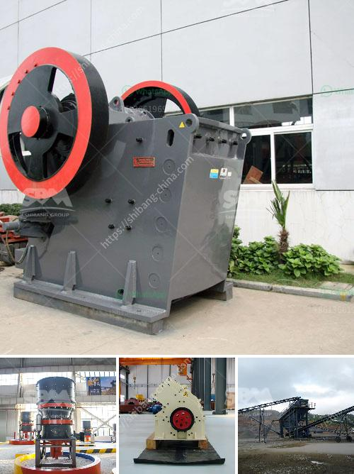

<h3>crusher allis cone chalmers mod 500</h3>
The Allis Chalmers Mod 500 Cone Crusher is a well-built piece of machinery that perfectly blends ruggedness, durability, and functionality. With decades of experience in manufacturing crushers, Allis Chalmers has created a machine that is not only reliable but also able to provide outstanding performance.

The Mod 500 utilizes Allis Chalmers' expertise in cone crushing technology to maximize efficiency and productivity. This cone crusher is designed to deliver high production capabilities and exceptional reduction ratios, making it an ideal choice for crushing applications in various industries.

Equipped with a powerful motor, the Mod 500 provides sufficient power to handle demanding materials and tough conditions. The cone crusher's robust construction ensures long-term operation, even in the harshest environments. Its durable components and steel frame contribute to its overall strength and reliability.

Featuring a user-friendly control panel, operating the Mod 500 is straightforward, allowing operators to easily adjust the cone crusher's settings and achieve precise product sizes. The cone crusher also includes a hydraulic system that provides reliable and safe tramp iron relief, preventing damage to the crusher and ensuring uninterrupted operation.

Furthermore, the Allis Chalmers Mod 500 Cone Crusher offers versatility in its applications. From aggregates to mining, this machine can handle various types of materials, making it suitable for a wide range of industries. Its high crushing capacity and consistent performance guarantee efficient and cost-effective operation.

In conclusion, the Allis Chalmers Mod 500 Cone Crusher is a reliable and efficient machine that can meet the demands of any crushing application. Its robust construction, powerful motor, and user-friendly features make it an ideal choice for companies in various industries. Whether you are producing aggregates or involved in mining operations, this cone crusher will undoubtedly enhance your productivity and profitability.
<h3>Contact us</h3><ul><li><strong>Whatsapp:&nbsp;<a href="https://wa.me/8613661969651">+8613661969651</a></strong></li><li><a href="https://swt.shibang-china.com/?git&amp;zhl&amp;crusher allis cone chalmers mod 500"><strong>Online Service(chat now)</strong></a></li></ul><h3>Related</h3><ul><li><a href='tanzania processing plant cost.md'>tanzania processing plant cost</a></li><li><a href='stone crusher used for sale spain.md'>stone crusher used for sale spain</a></li><li><a href='gold mining equipment south africa.md'>gold mining equipment south africa</a></li><li><a href='used chrome ore mining crushing equipment crusher.md'>used chrome ore mining crushing equipment crusher</a></li><li><a href='mobile crushing unit.md'>mobile crushing unit</a></li></ul>